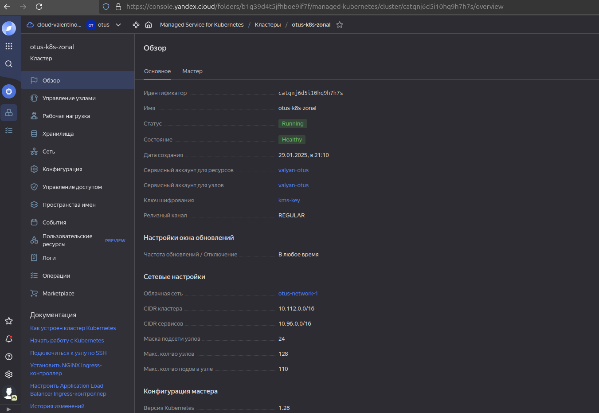
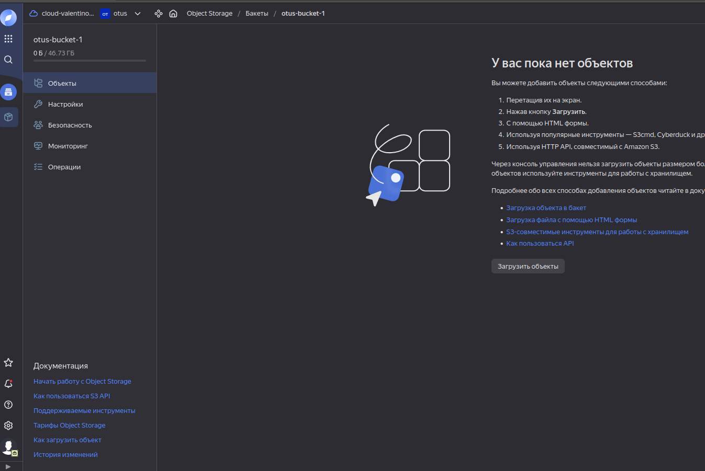
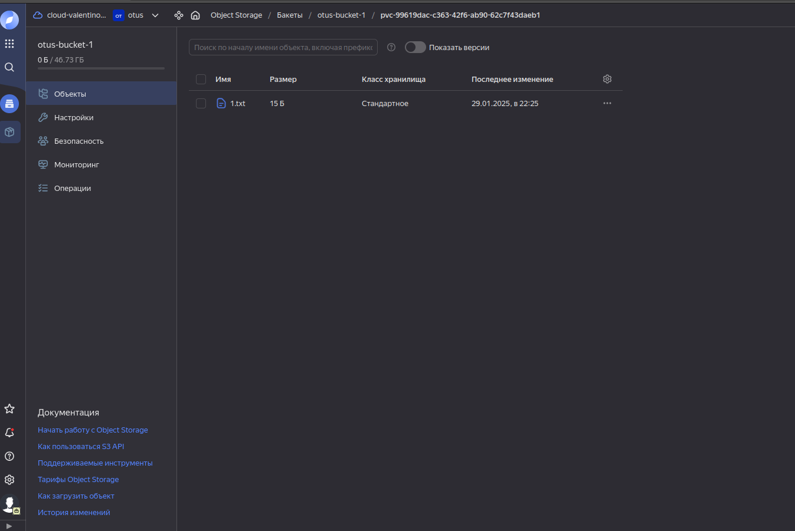

Создаем managed k8s с 1 node-group и пустым s3-bucket при помощи terraform:  


<details>

```bash
valyan@valyan-pc:~/proj/Valyanchik_repo/kubernetes-csi/terraform$ yc managed-kubernetes cluster list
+----------------------+----------------+---------------------+---------+---------+------------------------+---------------------+
|          ID          |      NAME      |     CREATED AT      | HEALTH  | STATUS  |   EXTERNAL ENDPOINT    |  INTERNAL ENDPOINT  |
+----------------------+----------------+---------------------+---------+---------+------------------------+---------------------+
| cat06q019p0lgielkck5 | otus-k8s-zonal | 2025-01-29 18:45:56 | HEALTHY | RUNNING | https://89.169.145.222 | https://172.16.0.30 |
+----------------------+----------------+---------------------+---------+---------+------------------------+---------------------+
```
</details>  

    

<details>

```bash
valyan@valyan-pc:~/proj/Valyanchik_repo/kubernetes-csi/terraform$ yc storage bucket list 
+---------------+----------------------+-------------+-----------------------+---------------------+
|     NAME      |      FOLDER ID       |  MAX SIZE   | DEFAULT STORAGE CLASS |     CREATED AT      |
+---------------+----------------------+-------------+-----------------------+---------------------+
| otus-bucket-1 | b1g39d4t5jfhboe9if7f | 50179869184 | COLD                  | 2025-01-29 18:57:24 |
+---------------+----------------------+-------------+-----------------------+---------------------+

```
</details>

 
  


Пробрасываем креды для доступа к кластеру извне:  
<details>

```bash
valyan@valyan-pc:~/proj/Valyanchik_repo/kubernetes-csi/terraform$ yc managed-kubernetes cluster get-credentials otus-k8s-zonal --external --force

Context 'yc-otus-k8s-zonal' was added as default to kubeconfig '/home/valyan/.kube/config'.
Check connection to cluster using 'kubectl cluster-info --kubeconfig /home/valyan/.kube/config'.

Note, that authentication depends on 'yc' and its config profile 'default'.
To access clusters using the Kubernetes API, please use Kubernetes Service Account.
valyan@valyan-pc:~/proj/Valyanchik_repo/kubernetes-csi/terraform$ k get ns
NAME              STATUS   AGE
default           Active   4m26s
kube-node-lease   Active   4m26s
kube-public       Active   4m26s
kube-system       Active   4m26s
yandex-system     Active   4m4s
```
</details>


После чего по гайду Яндекса делаем пошагово:
1) Отдельно создаем статичный ключ доступа к s3 бакету (вариант с созданием через terraform не подходит, т.к нельзя никак получить access-key-secret после создания, только через yc cli или веб-морду при  первом создании ключа):   

<details>

```bash
valyan@valyan-pc:~/proj/Valyanchik_repo/kubernetes-csi/terraform$ yc iam access-key create --service-account-name valyan-otus
access_key:
  id: ajedjkcbrrl5dmi50h25
  service_account_id: ********
  created_at: "2025-01-29T19:04:13.642789304Z"
  key_id: YCAJE0fce_po27mRWMLS4eIu4
secret: ******************
```
</details>

2) Забираем полученные на предыдущем шаге атрибуты статичного ключа доступа и создаем секрет для доступа из подов в бакет:   

<details>

```bash
valyan@valyan-pc:~/proj/Valyanchik_repo/kubernetes-csi/terraform$ k describe secret -n kube-system csi-s3-secret 
Name:         csi-s3-secret
Namespace:    kube-system
Labels:       <none>
Annotations:  <none>

Type:  Opaque

Data
====
accessKeyID:      25 bytes
endpoint:         31 bytes
secretAccessKey:  40 bytes

```
</details>

3) Создаем кастомный storageClass с указанием в его атрибутах созданного секрета и созданного s3-бакета:  

<details>

```bash
valyan@valyan-pc:~/proj/Valyanchik_repo/kubernetes-csi/terraform$ k get storageclasses.storage.k8s.io
NAME                           PROVISIONER                     RECLAIMPOLICY   VOLUMEBINDINGMODE      ALLOWVOLUMEEXPANSION   AGE
csi-s3-sc                      ru.yandex.s3.csi                Delete          Immediate              false                  9s
yc-network-hdd (default)       disk-csi-driver.mks.ycloud.io   Delete          WaitForFirstConsumer   true                   13m
yc-network-nvme                disk-csi-driver.mks.ycloud.io   Delete          WaitForFirstConsumer   true                   13m
yc-network-ssd                 disk-csi-driver.mks.ycloud.io   Delete          WaitForFirstConsumer   true                   13m
yc-network-ssd-io-m3           disk-csi-driver.mks.ycloud.io   Delete          WaitForFirstConsumer   true                   13m
yc-network-ssd-nonreplicated   disk-csi-driver.mks.ycloud.io   Delete          WaitForFirstConsumer   true                   13m

valyan@valyan-pc:~/proj/Valyanchik_repo/kubernetes-csi/terraform$ k describe storageclasses.storage.k8s.io csi-s3-sc
Name:            csi-s3-sc
IsDefaultClass:  No
Annotations:     kubectl.kubernetes.io/last-applied-configuration={"apiVersion":"storage.k8s.io/v1","kind":"StorageClass","metadata":{"annotations":{},"name":"csi-s3-sc"},"parameters":{"bucket":"csi-hw","csi.storage.k8s.io/controller-publish-secret-name":"csi-s3-secret","csi.storage.k8s.io/controller-publish-secret-namespace":"kube-system","csi.storage.k8s.io/node-publish-secret-name":"csi-s3-secret","csi.storage.k8s.io/node-publish-secret-namespace":"kube-system","csi.storage.k8s.io/node-stage-secret-name":"csi-s3-secret","csi.storage.k8s.io/node-stage-secret-namespace":"kube-system","csi.storage.k8s.io/provisioner-secret-name":"csi-s3-secret","csi.storage.k8s.io/provisioner-secret-namespace":"kube-system","mounter":"geesefs","options":"--memory-limit=1000 --dir-mode=0777 --file-mode=0666"},"provisioner":"ru.yandex.s3.csi"}

Provisioner:           ru.yandex.s3.csi
Parameters:            bucket=csi-hw,csi.storage.k8s.io/controller-publish-secret-name=csi-s3-secret,csi.storage.k8s.io/controller-publish-secret-namespace=kube-system,csi.storage.k8s.io/node-publish-secret-name=csi-s3-secret,csi.storage.k8s.io/node-publish-secret-namespace=kube-system,csi.storage.k8s.io/node-stage-secret-name=csi-s3-secret,csi.storage.k8s.io/node-stage-secret-namespace=kube-system,csi.storage.k8s.io/provisioner-secret-name=csi-s3-secret,csi.storage.k8s.io/provisioner-secret-namespace=kube-system,mounter=geesefs,options=--memory-limit=1000 --dir-mode=0777 --file-mode=0666
AllowVolumeExpansion:  <unset>
MountOptions:          <none>
ReclaimPolicy:         Delete
VolumeBindingMode:     Immediate
Events:                <none>

```
</details>

4) Далее копируем указанный Яндексом репозиторий с csi-драйвером и провижинером и создаем их по инструкции:    

<details>

```bash
valyan@valyan-pc:~/proj$ git clone https://github.com/yandex-cloud/k8s-csi-s3.git
Cloning into 'k8s-csi-s3'...
remote: Enumerating objects: 2033, done.
remote: Counting objects: 100% (750/750), done.
remote: Compressing objects: 100% (200/200), done.
remote: Total 2033 (delta 619), reused 550 (delta 550), pack-reused 1283 (from 2)
Receiving objects: 100% (2033/2033), 473.22 KiB | 2.08 MiB/s, done.
Resolving deltas: 100% (1181/1181), done.

valyan@valyan-pc:~/proj$ kubectl create -f k8s-csi-s3/deploy/kubernetes/provisioner.yaml && kubectl create -f k8s-csi-s3/deploy/kubernetes/driver.yaml && kubectl create -f k8s-csi-s3/deploy/kubernetes/csi-s3.yaml
serviceaccount/csi-s3-provisioner-sa created
clusterrole.rbac.authorization.k8s.io/csi-s3-external-provisioner-runner created
clusterrolebinding.rbac.authorization.k8s.io/csi-s3-provisioner-role created
service/csi-s3-provisioner created
statefulset.apps/csi-s3-provisioner created
csidriver.storage.k8s.io/ru.yandex.s3.csi created
serviceaccount/csi-s3 created
clusterrole.rbac.authorization.k8s.io/csi-s3 created
clusterrolebinding.rbac.authorization.k8s.io/csi-s3 created
daemonset.apps/csi-s3 created

```
</details>

5) после успешного создания storageClass, secret, csi-driver, provisioner создаем динамический pvc, указав в его атрибутах имя созданного storageClass:    

<details>

```bash  
valyan@valyan-pc:~/proj$ k get pvc -n default
NAME         STATUS   VOLUME                                     CAPACITY   ACCESS MODES   STORAGECLASS   AGE
csi-s3-pvc   Bound    pvc-3236f637-33aa-423a-9157-458056f4396a   5Gi        RWX            csi-s3-sc      8s
valyan@valyan-pc:~/proj$ k describe pvc -n default
Name:          csi-s3-pvc
Namespace:     default
StorageClass:  csi-s3-sc
Status:        Bound
Volume:        pvc-3236f637-33aa-423a-9157-458056f4396a
Labels:        <none>
Annotations:   pv.kubernetes.io/bind-completed: yes
               pv.kubernetes.io/bound-by-controller: yes
               volume.beta.kubernetes.io/storage-provisioner: ru.yandex.s3.csi
               volume.kubernetes.io/storage-provisioner: ru.yandex.s3.csi
Finalizers:    [kubernetes.io/pvc-protection]
Capacity:      5Gi
Access Modes:  RWX
VolumeMode:    Filesystem
Used By:       <none>
Events:
  Type    Reason                 Age                From                                                                        Message
  ----    ------                 ----               ----                                                                        -------
  Normal  Provisioning           14s                ru.yandex.s3.csi_csi-s3-provisioner-0_9cf385f1-1c17-4898-a918-bee21b201561  External provisioner is provisioning volume for claim "default/csi-s3-pvc"
  Normal  ExternalProvisioning   14s (x2 over 14s)  persistentvolume-controller                                                 Waiting for a volume to be created either by the external provisioner 'ru.yandex.s3.csi' or manually by the system administrator. If volume creation is delayed, please verify that the provisioner is running and correctly registered.
  Normal  ProvisioningSucceeded  14s                ru.yandex.s3.csi_csi-s3-provisioner-0_9cf385f1-1c17-4898-a918-bee21b201561  Successfully provisioned volume pvc-3236f637-33aa-423a-9157-458056f4396a


```
</details>

6) Создаем под,  монитруя в него хранилище при помощи динамического pvc:  

<details>

```bash
valyan@valyan-pc:~/proj$ k get po -n default -w
NAME      READY   STATUS    RESTARTS   AGE
csi-pod   1/1     Running   0          17s
^Cvalyan@valyan-pc:~/proj$ k describe po -n default csi-pod 
Name:             csi-pod
Namespace:        default
Priority:         0
Service Account:  default
Node:             worker-exul-cl1vnkle5nkdcpf6homi/172.16.0.15
Start Time:       Wed, 29 Jan 2025 22:15:58 +0300
Labels:           <none>
Annotations:      <none>
Status:           Running
IP:               172.17.128.7
IPs:
  IP:  172.17.128.7
Containers:
  csi-pod:
    Container ID:   containerd://8c68348b53bded6b4728e54ef6e09a78a6c11b88bc4d9afbc4debd3a04f221f6
    Image:          nginx
    Image ID:       docker.io/library/nginx@sha256:0a399eb16751829e1af26fea27b20c3ec28d7ab1fb72182879dcae1cca21206a
    Port:           <none>
    Host Port:      <none>
    State:          Running
      Started:      Wed, 29 Jan 2025 22:16:09 +0300
    Ready:          True
    Restart Count:  0
    Environment:    <none>
    Mounts:
      /data from csi-hw (rw)
      /var/run/secrets/kubernetes.io/serviceaccount from kube-api-access-hpqm5 (ro)
Conditions:
  Type              Status
  Initialized       True 
  Ready             True 
  ContainersReady   True 
  PodScheduled      True 
Volumes:
  csi-hw:
    Type:       PersistentVolumeClaim (a reference to a PersistentVolumeClaim in the same namespace)
    ClaimName:  csi-s3-pvc
    ReadOnly:   false
  kube-api-access-hpqm5:
    Type:                    Projected (a volume that contains injected data from multiple sources)
    TokenExpirationSeconds:  3607
    ConfigMapName:           kube-root-ca.crt
    ConfigMapOptional:       <nil>
    DownwardAPI:             true
QoS Class:                   BestEffort
Node-Selectors:              <none>
Tolerations:                 node.kubernetes.io/not-ready:NoExecute op=Exists for 300s
                             node.kubernetes.io/unreachable:NoExecute op=Exists for 300s
Events:
  Type    Reason     Age   From               Message
  ----    ------     ----  ----               -------
  Normal  Scheduled  32s   default-scheduler  Successfully assigned default/csi-pod to worker-exul-cl1vnkle5nkdcpf6homi
  Normal  Pulling    31s   kubelet            Pulling image "nginx"
  Normal  Pulled     21s   kubelet            Successfully pulled image "nginx" in 9.975s (9.975s including waiting)
  Normal  Created    21s   kubelet            Created container csi-pod
  Normal  Started    21s   kubelet            Started container csi-pod


```
</details>

Для проверки работы доступа пода через pvc к нашему бакету создадим внутри пода в примонтированной шаре файлик и заполним его небольшим количеством данных:  

<details>

```bash
valyan@valyan-pc:~/proj$ k exec -it -n default csi-pod -- sh
df -h
Filesystem      Size  Used Avail Use% Mounted on
overlay          63G  9.9G   51G  17% /
tmpfs            64M     0   64M   0% /dev
tmpfs           3.9G     0  3.9G   0% /sys/fs/cgroup
otus-bucket-1   1.0P     0  1.0P   0% /data
/dev/vda2        63G  9.9G   51G  17% /etc/hosts
shm              64M     0   64M   0% /dev/shm
tmpfs           5.8G   12K  5.8G   1% /run/secrets/kubernetes.io/serviceaccount
tmpfs           3.9G     0  3.9G   0% /proc/acpi
tmpfs           3.9G     0  3.9G   0% /proc/scsi
tmpfs           3.9G     0  3.9G   0% /sys/firmware
cd /data
ls
touch 1.txt
echo "Hello from pod" > 1.txt
ls -lah
total 8.5K
drwxrwxrwx 2 root root 4.0K Jan 29 19:25 .
drwxr-xr-x 1 root root 4.0K Jan 29 19:24 ..
-rw-rw-rw- 1 root root   15 Jan 29 19:25 1.txt

```
</details>

Здесь виден размер файла в 15 байт и дата обновления 22:25(внутри пода формат времени по utc, поэтому отставание на 3 часа), В бакете этот файл появился:  

Созданный pvc внутри s3-хранилки:    


Созданный файл внутри пода в примонтированном при помощи pvc волюме:  


Удаляем инфраструктуру при помощи terraform destroy, однако не пустой бакет удалить не получится:  

<details>

```bash
│ Error: error deleting Storage Bucket (otus-bucket-1): BucketNotEmpty: The bucket you tried to delete is not empty.
│       status code: 409, request id: f91591ffb14cafe6, host id: 

```
</details>

Нужно зайти в веб-морду и удалить из бакета все обьекты, в нашем случае  - созданный pvc  