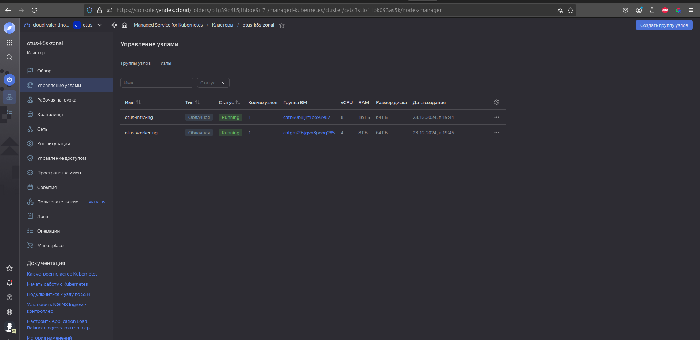
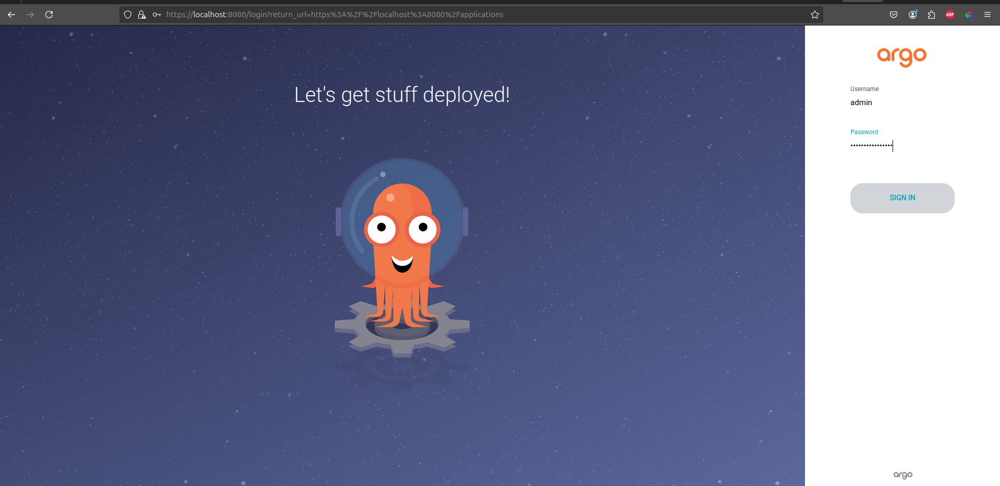
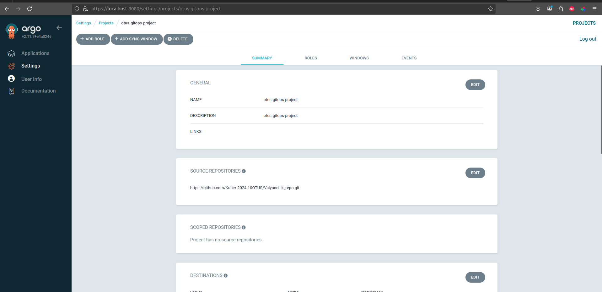
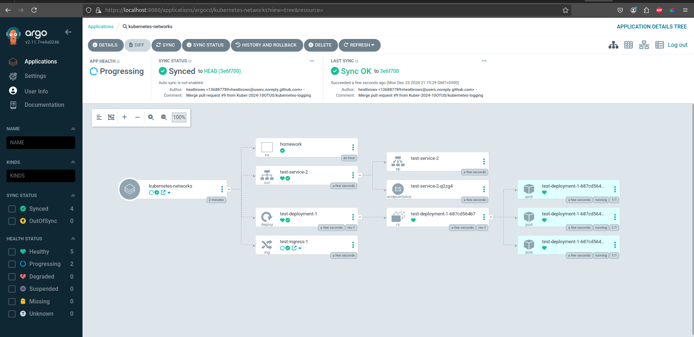
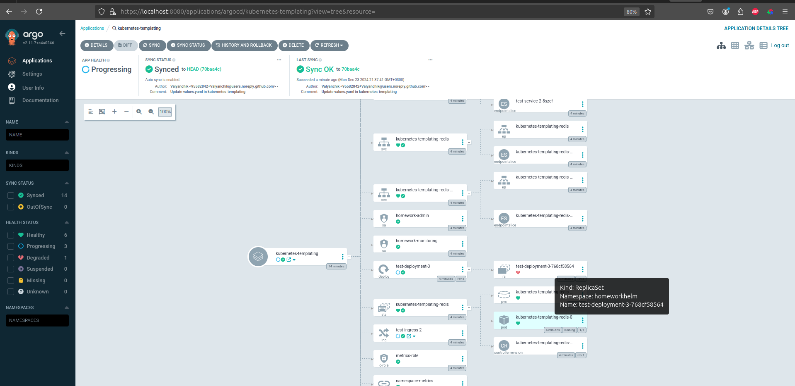
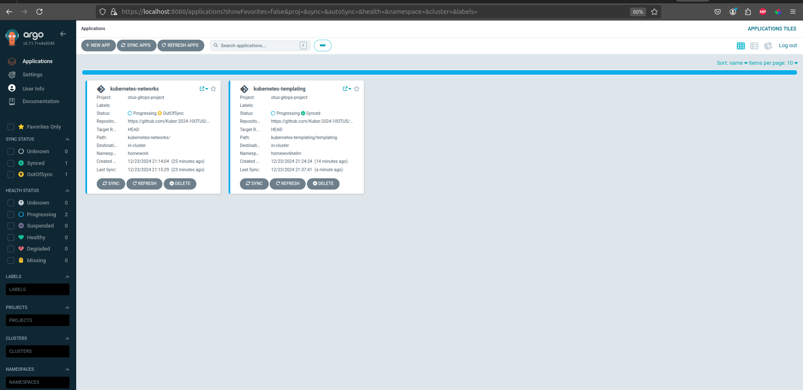
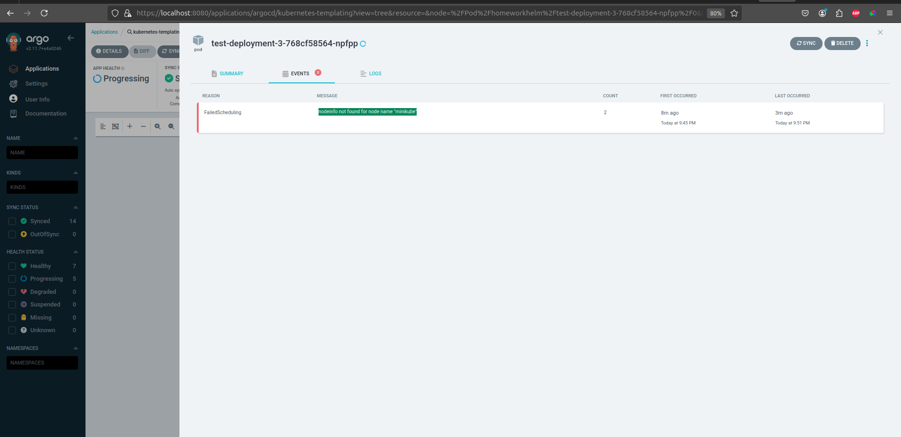

Для начала инициализируем облако и создаем минимально-необходимый набор ресурсов (сервисный аккаунт, статический ключ доступа, каталог, сеть), можно сделать при помощи yc утилиты, через веб-консоль или при помощи terraform:    


<details>

```bash
valyan@valyan-pc:~/proj/Valyanchik_repo/kubernetes-gitops/terraform$ terraform apply -auto-approve

Terraform used the selected providers to generate the following execution plan. Resource actions are indicated with the following symbols:
  + create

Terraform will perform the following actions:

  # yandex_kms_symmetric_key.kms-key will be created
  + resource "yandex_kms_symmetric_key" "kms-key" {
      + created_at          = (known after apply)
      + default_algorithm   = "AES_128"
      + deletion_protection = false
      + folder_id           = (known after apply)
      + id                  = (known after apply)
      + name                = "kms-key"
      + rotated_at          = (known after apply)
      + rotation_period     = "8760h"
      + status              = (known after apply)
    }

  # yandex_kubernetes_cluster.otus-k8s-zonal will be created
  + resource "yandex_kubernetes_cluster" "otus-k8s-zonal" {
      + cluster_ipv4_range       = "172.17.0.0/16"
      + cluster_ipv6_range       = (known after apply)
      + created_at               = (known after apply)
      + description              = (known after apply)
      + folder_id                = (known after apply)
      + health                   = (known after apply)
      + id                       = (known after apply)
      + labels                   = (known after apply)
      + log_group_id             = (known after apply)
      + name                     = "otus-k8s-zonal"
      + network_id               = (known after apply)
      + node_ipv4_cidr_mask_size = 24
      + node_service_account_id  = "************"
      + release_channel          = (known after apply)
      + service_account_id       = "***********"
      + service_ipv4_range       = "172.18.0.0/16"
      + service_ipv6_range       = (known after apply)
      + status                   = (known after apply)

      + kms_provider {
          + key_id = (known after apply)
        }

      + master {
          + cluster_ca_certificate = (known after apply)
          + etcd_cluster_size      = (known after apply)
          + external_v4_address    = (known after apply)
          + external_v4_endpoint   = (known after apply)
          + external_v6_endpoint   = (known after apply)
          + internal_v4_address    = (known after apply)
          + internal_v4_endpoint   = (known after apply)
          + public_ip              = true
          + security_group_ids     = (known after apply)
          + version                = "1.28"
          + version_info           = (known after apply)

          + maintenance_policy (known after apply)

          + master_location {
              + subnet_id = (known after apply)
              + zone      = "ru-central1-a"
            }

          + regional (known after apply)

          + zonal (known after apply)
        }
    }

  # yandex_kubernetes_node_group.otus-infra-ng will be created
  + resource "yandex_kubernetes_node_group" "otus-infra-ng" {
      + allowed_unsafe_sysctls = [
          + "kernel.msg*",
          + "net.core.somaxconn",
        ]
      + cluster_id             = (known after apply)
      + created_at             = (known after apply)
      + description            = "nodegroup for infrastructure services"
      + id                     = (known after apply)
      + instance_group_id      = (known after apply)
      + labels                 = {
          + "node-role" = "infra"
        }
      + name                   = "otus-infra-ng"
      + node_labels            = {
          + "node-role" = "infra"
        }
      + node_taints            = [
          + "node-role=infra:NoSchedule",
        ]
      + status                 = (known after apply)
      + version                = "1.28"
      + version_info           = (known after apply)

      + allocation_policy (known after apply)

      + deploy_policy {
          + max_expansion   = 3
          + max_unavailable = 1
        }

      + instance_template {
          + metadata                  = (known after apply)
          + name                      = "infra-{instance.short_id}-{instance_group.id}"
          + nat                       = (known after apply)
          + network_acceleration_type = "standard"
          + platform_id               = "standard-v1"

          + boot_disk {
              + size = 64
              + type = "network-hdd"
            }

          + container_network (known after apply)

          + container_runtime (known after apply)

          + gpu_settings (known after apply)

          + network_interface {
              + ipv4               = true
              + ipv6               = (known after apply)
              + nat                = true
              + security_group_ids = (known after apply)
              + subnet_ids         = (known after apply)
            }

          + resources {
              + core_fraction = 100
              + cores         = 8
              + gpus          = 0
              + memory        = 16
            }

          + scheduling_policy {
              + preemptible = true
            }
        }

      + maintenance_policy {
          + auto_repair  = true
          + auto_upgrade = true

          + maintenance_window {
              + duration   = "10h"
              + start_time = "22:00"
                # (1 unchanged attribute hidden)
            }
        }

      + scale_policy {
          + fixed_scale {
              + size = 1
            }
        }
    }

  # yandex_kubernetes_node_group.otus-worker-ng will be created
  + resource "yandex_kubernetes_node_group" "otus-worker-ng" {
      + allowed_unsafe_sysctls = [
          + "kernel.msg*",
          + "net.core.somaxconn",
        ]
      + cluster_id             = (known after apply)
      + created_at             = (known after apply)
      + description            = "nodegroup for application workload"
      + id                     = (known after apply)
      + instance_group_id      = (known after apply)
      + labels                 = {
          + "node-role" = "worker"
        }
      + name                   = "otus-worker-ng"
      + node_labels            = {
          + "node-role" = "worker"
        }
      + status                 = (known after apply)
      + version                = "1.28"
      + version_info           = (known after apply)

      + allocation_policy (known after apply)

      + deploy_policy {
          + max_expansion   = 3
          + max_unavailable = 1
        }

      + instance_template {
          + metadata                  = (known after apply)
          + name                      = "worker-{instance.short_id}-{instance_group.id}"
          + nat                       = (known after apply)
          + network_acceleration_type = "standard"
          + platform_id               = "standard-v1"

          + boot_disk {
              + size = 64
              + type = "network-hdd"
            }

          + container_network (known after apply)

          + container_runtime (known after apply)

          + gpu_settings (known after apply)

          + network_interface {
              + ipv4               = true
              + ipv6               = (known after apply)
              + nat                = true
              + security_group_ids = (known after apply)
              + subnet_ids         = (known after apply)
            }

          + resources {
              + core_fraction = 50
              + cores         = 4
              + gpus          = 0
              + memory        = 8
            }

          + scheduling_policy {
              + preemptible = true
            }
        }

      + maintenance_policy {
          + auto_repair  = true
          + auto_upgrade = true

          + maintenance_window {
              + duration   = "10h"
              + start_time = "22:00"
                # (1 unchanged attribute hidden)
            }
        }

      + scale_policy {
          + fixed_scale {
              + size = 1
            }
        }
    }

  # yandex_resourcemanager_folder_iam_member.encrypterDecrypter will be created
  + resource "yandex_resourcemanager_folder_iam_member" "encrypterDecrypter" {
      + folder_id = "************"
      + id        = (known after apply)
      + member    = "serviceAccount:************"
      + role      = "kms.keys.encrypterDecrypter"
    }

  # yandex_resourcemanager_folder_iam_member.images-puller will be created
  + resource "yandex_resourcemanager_folder_iam_member" "images-puller" {
      + folder_id = "************"
      + id        = (known after apply)
      + member    = "serviceAccount:************"
      + role      = "container-registry.images.puller"
    }

  # yandex_resourcemanager_folder_iam_member.k8s-clusters-agent will be created
  + resource "yandex_resourcemanager_folder_iam_member" "k8s-clusters-agent" {
      + folder_id = "***********"
      + id        = (known after apply)
      + member    = "serviceAccount:***********"
      + role      = "k8s.clusters.agent"
    }

  # yandex_resourcemanager_folder_iam_member.storageAdmin will be created
  + resource "yandex_resourcemanager_folder_iam_member" "storageAdmin" {
      + folder_id = "***********"
      + id        = (known after apply)
      + member    = "serviceAccount:***********"
      + role      = "storage.admin"
    }

  # yandex_resourcemanager_folder_iam_member.vpc-public-admin will be created
  + resource "yandex_resourcemanager_folder_iam_member" "vpc-public-admin" {
      + folder_id = "***********"
      + id        = (known after apply)
      + member    = "serviceAccount:***********"
      + role      = "vpc.publicAdmin"
    }

  # yandex_vpc_network.otus-network-1 will be created
  + resource "yandex_vpc_network" "otus-network-1" {
      + created_at                = (known after apply)
      + default_security_group_id = (known after apply)
      + folder_id                 = (known after apply)
      + id                        = (known after apply)
      + labels                    = (known after apply)
      + name                      = "otus-network-1"
      + subnet_ids                = (known after apply)
    }

  # yandex_vpc_security_group.k8s-cluster-traffic will be created
  + resource "yandex_vpc_security_group" "k8s-cluster-traffic" {
      + created_at  = (known after apply)
      + description = "Правила группы разрешают трафик для кластера. Примените ее к кластеру."
      + folder_id   = (known after apply)
      + id          = (known after apply)
      + labels      = (known after apply)
      + name        = "k8s-cluster-traffic"
      + network_id  = (known after apply)
      + status      = (known after apply)

      + egress {
          + description       = "Правило для исходящего трафика, разрешающее передачу трафика между мастером и подами metric-server."
          + from_port         = -1
          + id                = (known after apply)
          + labels            = (known after apply)
          + port              = 4443
          + protocol          = "TCP"
          + to_port           = -1
          + v4_cidr_blocks    = [
              + "172.16.0.0/16",
            ]
          + v6_cidr_blocks    = []
            # (2 unchanged attributes hidden)
        }

      + ingress {
          + description       = "Правило для входящего трафика, разрешающее доступ к API Kubernetes (порт 443)."
          + from_port         = -1
          + id                = (known after apply)
          + labels            = (known after apply)
          + port              = 443
          + protocol          = "TCP"
          + to_port           = -1
          + v4_cidr_blocks    = [
              + "0.0.0.0/0",
            ]
          + v6_cidr_blocks    = []
            # (2 unchanged attributes hidden)
        }
      + ingress {
          + description       = "Правило для входящего трафика, разрешающее доступ к API Kubernetes (порт 6443)."
          + from_port         = -1
          + id                = (known after apply)
          + labels            = (known after apply)
          + port              = 6443
          + protocol          = "TCP"
          + to_port           = -1
          + v4_cidr_blocks    = [
              + "0.0.0.0/0",
            ]
          + v6_cidr_blocks    = []
            # (2 unchanged attributes hidden)
        }
    }

  # yandex_vpc_security_group.k8s-public-services will be created
  + resource "yandex_vpc_security_group" "k8s-public-services" {
      + created_at  = (known after apply)
      + description = "Правила группы разрешают подключение к сервисам из интернета. Примените правила только для групп узлов."
      + folder_id   = (known after apply)
      + id          = (known after apply)
      + labels      = (known after apply)
      + name        = "k8s-public-services"
      + network_id  = (known after apply)
      + status      = (known after apply)

      + egress {
          + description       = "Правило разрешает весь исходящий трафик. Узлы могут связаться с Yandex Container Registry, Yandex Object Storage, Docker Hub и т. д."
          + from_port         = 0
          + id                = (known after apply)
          + labels            = (known after apply)
          + port              = -1
          + protocol          = "ANY"
          + to_port           = 65535
          + v4_cidr_blocks    = [
              + "0.0.0.0/0",
            ]
          + v6_cidr_blocks    = []
            # (2 unchanged attributes hidden)
        }

      + ingress {
          + description       = "Правило разрешает взаимодействие мастер-узел и узел-узел внутри группы безопасности."
          + from_port         = 0
          + id                = (known after apply)
          + labels            = (known after apply)
          + port              = -1
          + predefined_target = "self_security_group"
          + protocol          = "ANY"
          + to_port           = 65535
          + v4_cidr_blocks    = []
          + v6_cidr_blocks    = []
            # (1 unchanged attribute hidden)
        }
      + ingress {
          + description       = "Правило разрешает взаимодействие под-под и сервис-сервис. Укажите подсети вашего кластера Managed Service for Kubernetes и сервисов."
          + from_port         = 0
          + id                = (known after apply)
          + labels            = (known after apply)
          + port              = -1
          + protocol          = "ANY"
          + to_port           = 65535
          + v4_cidr_blocks    = [
              + "172.18.0.0/16",
              + "172.17.0.0/16",
              + "172.16.0.0/16",
            ]
          + v6_cidr_blocks    = []
            # (2 unchanged attributes hidden)
        }
      + ingress {
          + description       = "Правило разрешает входящий трафик из интернета на диапазон портов NodePort. Добавьте или измените порты на нужные вам."
          + from_port         = 30000
          + id                = (known after apply)
          + labels            = (known after apply)
          + port              = -1
          + protocol          = "TCP"
          + to_port           = 32767
          + v4_cidr_blocks    = [
              + "0.0.0.0/0",
            ]
          + v6_cidr_blocks    = []
            # (2 unchanged attributes hidden)
        }
      + ingress {
          + description       = "Правило разрешает отладочные ICMP-пакеты из внутренних подсетей."
          + from_port         = -1
          + id                = (known after apply)
          + labels            = (known after apply)
          + port              = -1
          + protocol          = "ICMP"
          + to_port           = -1
          + v4_cidr_blocks    = [
              + "172.16.0.0/16",
              + "172.18.0.0/16",
              + "172.17.0.0/16",
            ]
          + v6_cidr_blocks    = []
            # (2 unchanged attributes hidden)
        }
      + ingress {
          + description       = "Правило разрешает проверки доступности с диапазона адресов балансировщика нагрузки. Нужно для работы отказоустойчивого кластера Managed Service for Kubernetes и сервисов балансировщика."
          + from_port         = 0
          + id                = (known after apply)
          + labels            = (known after apply)
          + port              = -1
          + predefined_target = "loadbalancer_healthchecks"
          + protocol          = "TCP"
          + to_port           = 65535
          + v4_cidr_blocks    = []
          + v6_cidr_blocks    = []
            # (1 unchanged attribute hidden)
        }
    }

  # yandex_vpc_subnet.otus-subnet-1 will be created
  + resource "yandex_vpc_subnet" "otus-subnet-1" {
      + created_at     = (known after apply)
      + folder_id      = (known after apply)
      + id             = (known after apply)
      + labels         = (known after apply)
      + name           = "otus-subnet-1"
      + network_id     = (known after apply)
      + v4_cidr_blocks = [
          + "172.16.0.0/16",
        ]
      + v6_cidr_blocks = (known after apply)
      + zone           = "ru-central1-a"
    }

Plan: 13 to add, 0 to change, 0 to destroy.
yandex_resourcemanager_folder_iam_member.images-puller: Creating...
yandex_resourcemanager_folder_iam_member.storageAdmin: Creating...
yandex_resourcemanager_folder_iam_member.encrypterDecrypter: Creating...
yandex_resourcemanager_folder_iam_member.vpc-public-admin: Creating...
yandex_vpc_network.otus-network-1: Creating...
yandex_resourcemanager_folder_iam_member.k8s-clusters-agent: Creating...
yandex_kms_symmetric_key.kms-key: Creating...
yandex_kms_symmetric_key.kms-key: Creation complete after 0s [id=***********]
yandex_vpc_network.otus-network-1: Creation complete after 1s [id=***********]
yandex_vpc_subnet.otus-subnet-1: Creating...
yandex_vpc_security_group.k8s-public-services: Creating...
yandex_vpc_subnet.otus-subnet-1: Creation complete after 1s [id=***********]
yandex_vpc_security_group.k8s-cluster-traffic: Creating...
yandex_vpc_security_group.k8s-public-services: Creation complete after 1s [id=enpjojhdhikaao3jnf1q]
yandex_resourcemanager_folder_iam_member.storageAdmin: Creation complete after 2s [id=***********/storage.admin/serviceAccount:***********]
yandex_vpc_security_group.k8s-cluster-traffic: Creation complete after 1s [id=enplt15ukh31rioksmt6]
yandex_resourcemanager_folder_iam_member.images-puller: Creation complete after 5s [id=***********/container-registry.images.puller/serviceAccount:***********]
yandex_resourcemanager_folder_iam_member.encrypterDecrypter: Creation complete after 7s [id=***********/kms.keys.encrypterDecrypter/serviceAccount:***********]
yandex_resourcemanager_folder_iam_member.vpc-public-admin: Still creating... [10s elapsed]
yandex_resourcemanager_folder_iam_member.k8s-clusters-agent: Still creating... [10s elapsed]
yandex_resourcemanager_folder_iam_member.vpc-public-admin: Creation complete after 10s [id=***********/vpc.publicAdmin/serviceAccount:***********]
yandex_resourcemanager_folder_iam_member.k8s-clusters-agent: Creation complete after 12s [id=***********/k8s.clusters.agent/serviceAccount:***********]
yandex_kubernetes_cluster.otus-k8s-zonal: Creating...
yandex_kubernetes_cluster.otus-k8s-zonal: Still creating... [10s elapsed]
yandex_kubernetes_cluster.otus-k8s-zonal: Still creating... [20s elapsed]
yandex_kubernetes_cluster.otus-k8s-zonal: Still creating... [30s elapsed]
yandex_kubernetes_cluster.otus-k8s-zonal: Still creating... [40s elapsed]
yandex_kubernetes_cluster.otus-k8s-zonal: Still creating... [50s elapsed]
yandex_kubernetes_cluster.otus-k8s-zonal: Still creating... [1m0s elapsed]
yandex_kubernetes_cluster.otus-k8s-zonal: Still creating... [1m10s elapsed]
yandex_kubernetes_cluster.otus-k8s-zonal: Still creating... [1m20s elapsed]
yandex_kubernetes_cluster.otus-k8s-zonal: Still creating... [1m30s elapsed]
yandex_kubernetes_cluster.otus-k8s-zonal: Still creating... [1m40s elapsed]
yandex_kubernetes_cluster.otus-k8s-zonal: Still creating... [1m50s elapsed]
yandex_kubernetes_cluster.otus-k8s-zonal: Still creating... [2m0s elapsed]
yandex_kubernetes_cluster.otus-k8s-zonal: Still creating... [2m10s elapsed]
yandex_kubernetes_cluster.otus-k8s-zonal: Still creating... [2m20s elapsed]
yandex_kubernetes_cluster.otus-k8s-zonal: Still creating... [2m30s elapsed]
yandex_kubernetes_cluster.otus-k8s-zonal: Still creating... [2m40s elapsed]
yandex_kubernetes_cluster.otus-k8s-zonal: Still creating... [2m50s elapsed]
yandex_kubernetes_cluster.otus-k8s-zonal: Still creating... [3m0s elapsed]
yandex_kubernetes_cluster.otus-k8s-zonal: Still creating... [3m10s elapsed]
yandex_kubernetes_cluster.otus-k8s-zonal: Still creating... [3m20s elapsed]
yandex_kubernetes_cluster.otus-k8s-zonal: Still creating... [3m30s elapsed]
yandex_kubernetes_cluster.otus-k8s-zonal: Still creating... [3m40s elapsed]
yandex_kubernetes_cluster.otus-k8s-zonal: Still creating... [3m50s elapsed]
yandex_kubernetes_cluster.otus-k8s-zonal: Still creating... [4m0s elapsed]
yandex_kubernetes_cluster.otus-k8s-zonal: Still creating... [4m10s elapsed]
yandex_kubernetes_cluster.otus-k8s-zonal: Still creating... [4m20s elapsed]
yandex_kubernetes_cluster.otus-k8s-zonal: Still creating... [4m30s elapsed]
yandex_kubernetes_cluster.otus-k8s-zonal: Still creating... [4m40s elapsed]
yandex_kubernetes_cluster.otus-k8s-zonal: Still creating... [4m50s elapsed]
yandex_kubernetes_cluster.otus-k8s-zonal: Still creating... [5m0s elapsed]
yandex_kubernetes_cluster.otus-k8s-zonal: Still creating... [5m10s elapsed]
yandex_kubernetes_cluster.otus-k8s-zonal: Still creating... [5m20s elapsed]
yandex_kubernetes_cluster.otus-k8s-zonal: Still creating... [5m30s elapsed]
yandex_kubernetes_cluster.otus-k8s-zonal: Still creating... [5m40s elapsed]
yandex_kubernetes_cluster.otus-k8s-zonal: Still creating... [5m50s elapsed]
yandex_kubernetes_cluster.otus-k8s-zonal: Still creating... [6m0s elapsed]
yandex_kubernetes_cluster.otus-k8s-zonal: Still creating... [6m10s elapsed]
yandex_kubernetes_cluster.otus-k8s-zonal: Still creating... [6m20s elapsed]
yandex_kubernetes_cluster.otus-k8s-zonal: Still creating... [6m30s elapsed]
yandex_kubernetes_cluster.otus-k8s-zonal: Still creating... [6m40s elapsed]
yandex_kubernetes_cluster.otus-k8s-zonal: Still creating... [6m50s elapsed]
yandex_kubernetes_cluster.otus-k8s-zonal: Still creating... [7m0s elapsed]
yandex_kubernetes_cluster.otus-k8s-zonal: Still creating... [7m10s elapsed]
yandex_kubernetes_cluster.otus-k8s-zonal: Still creating... [7m20s elapsed]
yandex_kubernetes_cluster.otus-k8s-zonal: Still creating... [7m30s elapsed]
yandex_kubernetes_cluster.otus-k8s-zonal: Still creating... [7m40s elapsed]
yandex_kubernetes_cluster.otus-k8s-zonal: Still creating... [7m50s elapsed]
yandex_kubernetes_cluster.otus-k8s-zonal: Creation complete after 7m56s [id=catc3stlo11pk093as5k]
yandex_kubernetes_node_group.otus-worker-ng: Creating...
yandex_kubernetes_node_group.otus-infra-ng: Creating...
yandex_kubernetes_node_group.otus-infra-ng: Still creating... [10s elapsed]
yandex_kubernetes_node_group.otus-infra-ng: Still creating... [20s elapsed]
yandex_kubernetes_node_group.otus-infra-ng: Still creating... [30s elapsed]
yandex_kubernetes_node_group.otus-infra-ng: Still creating... [40s elapsed]
yandex_kubernetes_node_group.otus-infra-ng: Still creating... [50s elapsed]
yandex_kubernetes_node_group.otus-infra-ng: Still creating... [1m0s elapsed]
yandex_kubernetes_node_group.otus-infra-ng: Still creating... [1m10s elapsed]
yandex_kubernetes_node_group.otus-infra-ng: Still creating... [1m20s elapsed]
yandex_kubernetes_node_group.otus-infra-ng: Still creating... [1m30s elapsed]
yandex_kubernetes_node_group.otus-infra-ng: Creation complete after 1m38s [id=catb50b8ijrf1b693987]
╷
│ Error: error while requesting API to create Kubernetes node group: server-request-id = 08915d6a-ae73-4f7a-8536-e0ff94f1dc41 server-trace-id = b56b97d5401528d8:3ef5f042deb9c4bd:b56b97d5401528d8:1 client-request-id = 8a81a880-9d73-4b2f-a128-baa43fe0e0cb client-trace-id = 6264c1dd-befd-48be-a472-abc6de331bd9 rpc error: code = InvalidArgument desc = Validation error:
│ node_template.resources_spec.core_fraction: Core fraction 50 is not available for platform 'standard-v1'. Please use platform 'standard-v2' or core fraction 5, 20, 100.
│ 
│ 
│   with yandex_kubernetes_node_group.otus-worker-ng,
│   on node-group-worker.tf line 1, in resource "yandex_kubernetes_node_group" "otus-worker-ng":
│    1: resource "yandex_kubernetes_node_group" "otus-worker-ng" {
│ 
╵
valyan@valyan-pc:~/proj/Valyanchik_repo/kubernetes-gitops/terraform$ terraform apply -auto-approve
yandex_resourcemanager_folder_iam_member.images-puller: Refreshing state... [id=***********/container-registry.images.puller/serviceAccount:***********]
yandex_kms_symmetric_key.kms-key: Refreshing state... [id=***********]
yandex_resourcemanager_folder_iam_member.vpc-public-admin: Refreshing state... [id=***********/vpc.publicAdmin/serviceAccount:***********]
yandex_resourcemanager_folder_iam_member.k8s-clusters-agent: Refreshing state... [id=***********/k8s.clusters.agent/serviceAccount:***********]
yandex_resourcemanager_folder_iam_member.encrypterDecrypter: Refreshing state... [id=***********/kms.keys.encrypterDecrypter/serviceAccount:***********]
yandex_resourcemanager_folder_iam_member.storageAdmin: Refreshing state... [id=***********/storage.admin/serviceAccount:***********]
yandex_vpc_network.otus-network-1: Refreshing state... [id=***********]
yandex_vpc_subnet.otus-subnet-1: Refreshing state... [id=***********]
yandex_vpc_security_group.k8s-public-services: Refreshing state... [id=enpjojhdhikaao3jnf1q]
yandex_vpc_security_group.k8s-cluster-traffic: Refreshing state... [id=enplt15ukh31rioksmt6]
yandex_kubernetes_cluster.otus-k8s-zonal: Refreshing state... [id=catc3stlo11pk093as5k]
yandex_kubernetes_node_group.otus-infra-ng: Refreshing state... [id=catb50b8ijrf1b693987]

Terraform used the selected providers to generate the following execution plan. Resource actions are indicated with the following symbols:
  + create

Terraform will perform the following actions:

  # yandex_kubernetes_node_group.otus-worker-ng will be created
  + resource "yandex_kubernetes_node_group" "otus-worker-ng" {
      + allowed_unsafe_sysctls = [
          + "kernel.msg*",
          + "net.core.somaxconn",
        ]
      + cluster_id             = "catc3stlo11pk093as5k"
      + created_at             = (known after apply)
      + description            = "nodegroup for application workload"
      + id                     = (known after apply)
      + instance_group_id      = (known after apply)
      + labels                 = {
          + "node-role" = "worker"
        }
      + name                   = "otus-worker-ng"
      + node_labels            = {
          + "node-role" = "worker"
        }
      + status                 = (known after apply)
      + version                = "1.28"
      + version_info           = (known after apply)

      + allocation_policy (known after apply)

      + deploy_policy {
          + max_expansion   = 3
          + max_unavailable = 1
        }

      + instance_template {
          + metadata                  = (known after apply)
          + name                      = "worker-{instance.short_id}-{instance_group.id}"
          + nat                       = (known after apply)
          + network_acceleration_type = "standard"
          + platform_id               = "standard-v1"

          + boot_disk {
              + size = 64
              + type = "network-hdd"
            }

          + container_network (known after apply)

          + container_runtime (known after apply)

          + gpu_settings (known after apply)

          + network_interface {
              + ipv4               = true
              + ipv6               = (known after apply)
              + nat                = true
              + security_group_ids = [
                  + "enpjojhdhikaao3jnf1q",
                ]
              + subnet_ids         = [
                  + "***********",
                ]
            }

          + resources {
              + core_fraction = 100
              + cores         = 4
              + gpus          = 0
              + memory        = 8
            }

          + scheduling_policy {
              + preemptible = true
            }
        }

      + maintenance_policy {
          + auto_repair  = true
          + auto_upgrade = true

          + maintenance_window {
              + duration   = "10h"
              + start_time = "22:00"
                # (1 unchanged attribute hidden)
            }
        }

      + scale_policy {
          + fixed_scale {
              + size = 1
            }
        }
    }

Plan: 1 to add, 0 to change, 0 to destroy.
yandex_kubernetes_node_group.otus-worker-ng: Creating...
yandex_kubernetes_node_group.otus-worker-ng: Still creating... [10s elapsed]
yandex_kubernetes_node_group.otus-worker-ng: Still creating... [20s elapsed]
yandex_kubernetes_node_group.otus-worker-ng: Still creating... [30s elapsed]
yandex_kubernetes_node_group.otus-worker-ng: Still creating... [40s elapsed]
yandex_kubernetes_node_group.otus-worker-ng: Still creating... [50s elapsed]
yandex_kubernetes_node_group.otus-worker-ng: Still creating... [1m0s elapsed]
yandex_kubernetes_node_group.otus-worker-ng: Still creating... [1m10s elapsed]
yandex_kubernetes_node_group.otus-worker-ng: Still creating... [1m20s elapsed]
yandex_kubernetes_node_group.otus-worker-ng: Still creating... [1m30s elapsed]
yandex_kubernetes_node_group.otus-worker-ng: Still creating... [1m40s elapsed]
yandex_kubernetes_node_group.otus-worker-ng: Creation complete after 1m49s [id=catgm29sjgvn8pooq285]

Apply complete! Resources: 1 added, 0 changed, 0 destroyed.
valyan@valyan-pc:~/proj/Valyanchik_repo/kubernetes-gitops/terraform$ 
```
</details>

По итогам установки при помощи terraform получаем 2 нод-группы по 1 узлу в каждой:  
<details>

```bash
valyan@valyan-pc:~$ k get nodes --show-labels
NAME                               STATUS   ROLES    AGE    VERSION   LABELS
infra-yryn-cl189srlp7muum1rdem2    Ready    <none>   145m   v1.28.9   beta.kubernetes.io/arch=amd64,beta.kubernetes.io/instance-type=standard-v1,beta.kubernetes.io/os=linux,failure-domain.beta.kubernetes.io/zone=ru-central1-a,kubernetes.io/arch=amd64,kubernetes.io/hostname=infra-yryn-cl189srlp7muum1rdem2,kubernetes.io/os=linux,node-role=infra,node.kubernetes.io/instance-type=standard-v1,node.kubernetes.io/kube-proxy-ds-ready=true,node.kubernetes.io/masq-agent-ds-ready=true,node.kubernetes.io/node-problem-detector-ds-ready=true,topology.kubernetes.io/zone=ru-central1-a,yandex.cloud/node-group-id=catb50b8ijrf1b693987,yandex.cloud/pci-topology=k8s,yandex.cloud/preemptible=true
worker-ycuf-cl1oripe1fsnl3fsi2js   Ready    <none>   142m   v1.28.9   beta.kubernetes.io/arch=amd64,beta.kubernetes.io/instance-type=standard-v1,beta.kubernetes.io/os=linux,failure-domain.beta.kubernetes.io/zone=ru-central1-a,homework=true,kubernetes.io/arch=amd64,kubernetes.io/hostname=worker-ycuf-cl1oripe1fsnl3fsi2js,kubernetes.io/os=linux,node-role=worker,node.kubernetes.io/instance-type=standard-v1,node.kubernetes.io/kube-proxy-ds-ready=true,node.kubernetes.io/masq-agent-ds-ready=true,node.kubernetes.io/node-problem-detector-ds-ready=true,topology.kubernetes.io/zone=ru-central1-a,yandex.cloud/node-group-id=catgm29sjgvn8pooq285,yandex.cloud/pci-topology=k8s,yandex.cloud/preemptible=true
valyan@valyan-pc:~$ 

```
</details>

yanex cloud node-groups:    
  

инфраструктура готова, можно приступать к установке argocd. Качаем хелм-чарт по гайду яндекса:
<details>

```bash
valyan@valyan-pc:~$ helm pull oci://cr.yandex/yc-marketplace/yandex-cloud/argo/chart/argo-cd \
  --version 7.3.11-2 \
  --untar
Warning: chart media type application/tar+gzip is deprecated
Pulled: cr.yandex/yc-marketplace/yandex-cloud/argo/chart/argo-cd:7.3.11-2
Digest: sha256:e2ce3b12584f33fa4f832b28c401cc8cf4be5cfb2cbf9de7eaa44fa3f09fd205
```
</details>

Устанавливаем арго в инфра ноды:
<details>

```bash
valyan@valyan-pc:~$ helm install   --namespace argocd   --values /home/valyan/proj/Valyanchik_repo/kubernetes-gitops/argocd-values.yaml   argo-cd ./argo-cd/
NAME: argo-cd
LAST DEPLOYED: Mon Dec 23 20:12:21 2024
NAMESPACE: argocd
STATUS: deployed
REVISION: 1
TEST SUITE: None
NOTES:
In order to access the server UI you have the following options:

1. kubectl port-forward service/argo-cd-argocd-server -n argocd 8080:443

    and then open the browser on http://localhost:8080 and accept the certificate

2. enable ingress in the values file `server.ingress.enabled` and either
      - Add the annotation for ssl passthrough: https://argo-cd.readthedocs.io/en/stable/operator-manual/ingress/#option-1-ssl-passthrough
      - Set the `configs.params."server.insecure"` in the values file and terminate SSL at your ingress: https://argo-cd.readthedocs.io/en/stable/operator-manual/ingress/#option-2-multiple-ingress-objects-and-hosts


After reaching the UI the first time you can login with username: admin and the random password generated during the installation. You can find the password by running:

kubectl -n argocd get secret argocd-initial-admin-secret -o jsonpath="{.data.password}" | base64 -d

(You should delete the initial secret afterwards as suggested by the Getting Started Guide: https://argo-cd.readthedocs.io/en/stable/getting_started/#4-login-using-the-cli)

```
</details>

Установилось только  в инфра ноды:
<details>

```bash
valyan@valyan-pc:~$ k get po -n argocd -o wide
NAME                                                        READY   STATUS      RESTARTS   AGE   IP              NODE                              NOMINATED NODE   READINESS GATES
argo-cd-argocd-application-controller-0                     1/1     Running     0          66s   172.17.128.6    infra-yryn-cl189srlp7muum1rdem2   <none>           <none>
argo-cd-argocd-applicationset-controller-548c7b7664-6kprx   1/1     Running     0          66s   172.17.128.9    infra-yryn-cl189srlp7muum1rdem2   <none>           <none>
argo-cd-argocd-dex-server-59c56f49cf-jw6zj                  1/1     Running     0          66s   172.17.128.4    infra-yryn-cl189srlp7muum1rdem2   <none>           <none>
argo-cd-argocd-notifications-controller-656d6c9f4-zch7d     1/1     Running     0          66s   172.17.128.8    infra-yryn-cl189srlp7muum1rdem2   <none>           <none>
argo-cd-argocd-redis-866bc85869-wgdqg                       1/1     Running     0          66s   172.17.128.5    infra-yryn-cl189srlp7muum1rdem2   <none>           <none>
argo-cd-argocd-redis-secret-init-rc982                      0/1     Completed   0          86s   172.17.128.3    infra-yryn-cl189srlp7muum1rdem2   <none>           <none>
argo-cd-argocd-repo-server-6c6c44b8f4-wwm5q                 1/1     Running     0          66s   172.17.128.10   infra-yryn-cl189srlp7muum1rdem2   <none>           <none>
argo-cd-argocd-server-848bb4965f-jw2tw                      1/1     Running     0          66s   172.17.128.7    infra-yryn-cl189srlp7muum1rdem2   <none>           <none>

```
</details>

Пробрасываем порт по краткой подсказке после установки и переходим по указанному адресу предварительно забрав содержимое указанного секрета в качестве пароля для входа в веб-морду:
yanex cloud node-groups:    
  

Накидываем на воркер-ноду лейблы, чтоб на ней запускались приложения из предыдущих ДЗ:  
<details>

```bash
valyan@valyan-pc:~$ k label node worker-ycuf-cl1oripe1fsnl3fsi2js homework=true
node/worker-ycuf-cl1oripe1fsnl3fsi2js labeled
valyan@valyan-pc:~$ k get nodes --show-labels
NAME                               STATUS   ROLES    AGE   VERSION   LABELS
infra-yryn-cl189srlp7muum1rdem2    Ready    <none>   89m   v1.28.9   beta.kubernetes.io/arch=amd64,beta.kubernetes.io/instance-type=standard-v1,beta.kubernetes.io/os=linux,failure-domain.beta.kubernetes.io/zone=ru-central1-a,kubernetes.io/arch=amd64,kubernetes.io/hostname=infra-yryn-cl189srlp7muum1rdem2,kubernetes.io/os=linux,node-role=infra,node.kubernetes.io/instance-type=standard-v1,node.kubernetes.io/kube-proxy-ds-ready=true,node.kubernetes.io/masq-agent-ds-ready=true,node.kubernetes.io/node-problem-detector-ds-ready=true,topology.kubernetes.io/zone=ru-central1-a,yandex.cloud/node-group-id=catb50b8ijrf1b693987,yandex.cloud/pci-topology=k8s,yandex.cloud/preemptible=true
worker-ycuf-cl1oripe1fsnl3fsi2js   Ready    <none>   86m   v1.28.9   beta.kubernetes.io/arch=amd64,beta.kubernetes.io/instance-type=standard-v1,beta.kubernetes.io/os=linux,failure-domain.beta.kubernetes.io/zone=ru-central1-a,homework=true,kubernetes.io/arch=amd64,kubernetes.io/hostname=worker-ycuf-cl1oripe1fsnl3fsi2js,kubernetes.io/os=linux,node-role=worker,node.kubernetes.io/instance-type=standard-v1,node.kubernetes.io/kube-proxy-ds-ready=true,node.kubernetes.io/masq-agent-ds-ready=true,node.kubernetes.io/node-problem-detector-ds-ready=true,topology.kubernetes.io/zone=ru-central1-a,yandex.cloud/node-group-id=catgm29sjgvn8pooq285,yandex.cloud/pci-topology=k8s,yandex.cloud/preemptible=true

```
</details>
Сначала создаем project:  

  

После - создаем app для kubernetes-networks в argocd и проверяем, что получилось:  
<details>

```bash
valyan@valyan-pc:~$ k get all -n homework 
NAME                                     READY   STATUS    RESTARTS   AGE
pod/test-deployment-1-687cd564b7-7mc6l   1/1     Running   0          23s
pod/test-deployment-1-687cd564b7-fvrv7   1/1     Running   0          23s
pod/test-deployment-1-687cd564b7-gllxz   1/1     Running   0          23s

NAME                     TYPE        CLUSTER-IP       EXTERNAL-IP   PORT(S)   AGE
service/test-service-2   ClusterIP   172.18.225.129   <none>        80/TCP    23s

NAME                                READY   UP-TO-DATE   AVAILABLE   AGE
deployment.apps/test-deployment-1   3/3     3            3           23s

NAME                                           DESIRED   CURRENT   READY   AGE
replicaset.apps/test-deployment-1-687cd564b7   3         3         3       23s
```
</details>

В веб-морде выглядит как:

  


Создаем app для templating, предвариельно меняя неймспейс в мастер-ветке:
https://github.com/Kuber-2024-10OTUS/Valyanchik_repo/blob/main/kubernetes-templating/templating/values.yaml


По итогам получилось:  

  

Оба проекта выглядят как:  

 

При этом ресурсы каждого app развернуты в своем namespace:  
<details>

```bash
valyan@valyan-pc:~$ k get all -n homework
NAME                                     READY   STATUS    RESTARTS   AGE
pod/test-deployment-1-687cd564b7-7mc6l   1/1     Running   0          20m
pod/test-deployment-1-687cd564b7-fvrv7   1/1     Running   0          20m
pod/test-deployment-1-687cd564b7-gllxz   1/1     Running   0          20m

NAME                     TYPE       CLUSTER-IP       EXTERNAL-IP   PORT(S)        AGE
service/test-service-2   NodePort   172.18.130.181   <none>        80:30080/TCP   74s

NAME                                READY   UP-TO-DATE   AVAILABLE   AGE
deployment.apps/test-deployment-1   3/3     3            3           20m

NAME                                           DESIRED   CURRENT   READY   AGE
replicaset.apps/test-deployment-1-687cd564b7   3         3         3       20m
valyan@valyan-pc:~$ k get all -n homeworkhelm
NAME                                READY   STATUS    RESTARTS   AGE
pod/kubernetes-templating-redis-0   1/1     Running   0          75s

NAME                                           TYPE        CLUSTER-IP       EXTERNAL-IP   PORT(S)    AGE
service/kubernetes-templating-redis            ClusterIP   172.18.179.151   <none>        6379/TCP   78s
service/kubernetes-templating-redis-headless   ClusterIP   None             <none>        6379/TCP   78s

NAME                                READY   UP-TO-DATE   AVAILABLE   AGE
deployment.apps/test-deployment-3   0/2     0            0           78s

NAME                                           DESIRED   CURRENT   READY   AGE
replicaset.apps/test-deployment-3-768cf58564   2         0         0       78s

NAME                                           READY   AGE
statefulset.apps/kubernetes-templating-redis   1/1     78s
```
</details>

replicaset из homeworkhelm не поднимается из-за того, что в манифесте pv указана гвоздями прибитая нода миникуба из предыдущих дз, что видно в дескрайбе обьекта и в ивентах репликасета:  

 

 

Здесь только докручивать чарт из kubernetes-templating и вручную с флагом force и, желательно с recreate пересоздавать app в argocd  


удаляем оба приложения и смотрим, что кластер был очищен от обьектов приложений:  
<details>

```bash
valyan@valyan-pc:~$ k get all -n homework
No resources found in homework namespace.
valyan@valyan-pc:~$ k get all -n homeworkhelm
No resources found in homeworkhelm namespace.
```
</details>

После выполнения ДЗ  удаляем кластер из облака и чистим за собой все остальные ресурсы:  
<details>

```bash
valyan@valyan-pc:~/proj/Valyanchik_repo/kubernetes-gitops/terraform$ terraform destroy -auto-approve
yandex_resourcemanager_folder_iam_member.images-puller: Refreshing state... [id=***********/container-registry.images.puller/serviceAccount:***********]
yandex_resourcemanager_folder_iam_member.k8s-clusters-agent: Refreshing state... [id=***********/k8s.clusters.agent/serviceAccount:***********]
yandex_resourcemanager_folder_iam_member.vpc-public-admin: Refreshing state... [id=***********/vpc.publicAdmin/serviceAccount:***********]
yandex_resourcemanager_folder_iam_member.encrypterDecrypter: Refreshing state... [id=***********/kms.keys.encrypterDecrypter/serviceAccount:***********]
yandex_vpc_network.otus-network-1: Refreshing state... [id=***********]
yandex_resourcemanager_folder_iam_member.storageAdmin: Refreshing state... [id=***********/storage.admin/serviceAccount:***********]
yandex_kms_symmetric_key.kms-key: Refreshing state... [id=***********]
yandex_vpc_subnet.otus-subnet-1: Refreshing state... [id=***********]
yandex_vpc_security_group.k8s-public-services: Refreshing state... [id=enpjojhdhikaao3jnf1q]
yandex_vpc_security_group.k8s-cluster-traffic: Refreshing state... [id=enplt15ukh31rioksmt6]
yandex_kubernetes_cluster.otus-k8s-zonal: Refreshing state... [id=catc3stlo11pk093as5k]
yandex_kubernetes_node_group.otus-infra-ng: Refreshing state... [id=catb50b8ijrf1b693987]
yandex_kubernetes_node_group.otus-worker-ng: Refreshing state... [id=catgm29sjgvn8pooq285]

Terraform used the selected providers to generate the following execution plan. Resource actions are indicated with the following symbols:
  - destroy

Terraform will perform the following actions:

  # yandex_kms_symmetric_key.kms-key will be destroyed
  - resource "yandex_kms_symmetric_key" "kms-key" {
      - created_at          = "2024-12-23T16:33:37Z" -> null
      - default_algorithm   = "AES_128" -> null
      - deletion_protection = false -> null
      - folder_id           = "***********" -> null
      - id                  = "***********" -> null
      - labels              = {} -> null
      - name                = "kms-key" -> null
      - rotation_period     = "8760h0m0s" -> null
      - status              = "active" -> null
        # (2 unchanged attributes hidden)
    }

  # yandex_kubernetes_cluster.otus-k8s-zonal will be destroyed
  - resource "yandex_kubernetes_cluster" "otus-k8s-zonal" {
      - cluster_ipv4_range       = "172.17.0.0/16" -> null
      - created_at               = "2024-12-23T16:33:50Z" -> null
      - folder_id                = "***********" -> null
      - health                   = "healthy" -> null
      - id                       = "catc3stlo11pk093as5k" -> null
      - labels                   = {} -> null
      - name                     = "otus-k8s-zonal" -> null
      - network_id               = "***********" -> null
      - node_ipv4_cidr_mask_size = 24 -> null
      - node_service_account_id  = "***********" -> null
      - release_channel          = "REGULAR" -> null
      - service_account_id       = "***********" -> null
      - service_ipv4_range       = "172.18.0.0/16" -> null
      - status                   = "running" -> null
        # (4 unchanged attributes hidden)

      - kms_provider {
          - key_id = "***********" -> null
        }

      - master {
          - cluster_ca_certificate = <<-EOT
                -----BEGIN CERTIFICATE-----
                ****
                -----END CERTIFICATE-----
            EOT -> null
          - etcd_cluster_size      = 1 -> null
          - external_v4_address    = "130.193.50.169" -> null
          - external_v4_endpoint   = "https://130.193.50.169" -> null
          - internal_v4_address    = "172.16.0.8" -> null
          - internal_v4_endpoint   = "https://172.16.0.8" -> null
          - public_ip              = true -> null
          - security_group_ids     = [
              - "enpjojhdhikaao3jnf1q",
              - "enplt15ukh31rioksmt6",
            ] -> null
          - version                = "1.28" -> null
          - version_info           = [
              - {
                  - current_version        = "1.28"
                  - new_revision_available = false
                  - version_deprecated     = false
                    # (1 unchanged attribute hidden)
                },
            ] -> null
            # (2 unchanged attributes hidden)

          - maintenance_policy {
              - auto_upgrade = true -> null
            }

          - master_location {
              - subnet_id = "***********" -> null
              - zone      = "ru-central1-a" -> null
            }

          - zonal {
              - zone      = "ru-central1-a" -> null
                # (1 unchanged attribute hidden)
            }
        }
    }

  # yandex_kubernetes_node_group.otus-infra-ng will be destroyed
  - resource "yandex_kubernetes_node_group" "otus-infra-ng" {
      - allowed_unsafe_sysctls = [
          - "kernel.msg*",
          - "net.core.somaxconn",
        ] -> null
      - cluster_id             = "catc3stlo11pk093as5k" -> null
      - created_at             = "2024-12-23T16:41:45Z" -> null
      - description            = "nodegroup for infrastructure services" -> null
      - id                     = "catb50b8ijrf1b693987" -> null
      - instance_group_id      = "cl189srlp7muum1rdem2" -> null
      - labels                 = {
          - "node-role" = "infra"
        } -> null
      - name                   = "otus-infra-ng" -> null
      - node_labels            = {
          - "node-role" = "infra"
        } -> null
      - node_taints            = [
          - "node-role=infra:NoSchedule",
        ] -> null
      - status                 = "running" -> null
      - version                = "1.28" -> null
      - version_info           = [
          - {
              - current_version        = "1.28"
              - new_revision_available = false
              - version_deprecated     = false
                # (1 unchanged attribute hidden)
            },
        ] -> null

      - allocation_policy {
          - location {
              - subnet_id = "***********" -> null
              - zone      = "ru-central1-a" -> null
            }
        }

      - deploy_policy {
          - max_expansion   = 3 -> null
          - max_unavailable = 1 -> null
        }

      - instance_template {
          - labels                    = {} -> null
          - metadata                  = {} -> null
          - name                      = "infra-{instance.short_id}-{instance_group.id}" -> null
          - nat                       = true -> null
          - network_acceleration_type = "standard" -> null
          - platform_id               = "standard-v1" -> null

          - boot_disk {
              - size = 64 -> null
              - type = "network-hdd" -> null
            }

          - container_network {
              - pod_mtu = 0 -> null
            }

          - network_interface {
              - ipv4               = true -> null
              - ipv6               = false -> null
              - nat                = true -> null
              - security_group_ids = [
                  - "enpjojhdhikaao3jnf1q",
                ] -> null
              - subnet_ids         = [
                  - "***********",
                ] -> null
            }

          - resources {
              - core_fraction = 100 -> null
              - cores         = 8 -> null
              - gpus          = 0 -> null
              - memory        = 16 -> null
            }

          - scheduling_policy {
              - preemptible = true -> null
            }
        }

      - maintenance_policy {
          - auto_repair  = true -> null
          - auto_upgrade = true -> null

          - maintenance_window {
              - duration   = "10h0m0s" -> null
              - start_time = "22:00:00.000000000" -> null
                # (1 unchanged attribute hidden)
            }
        }

      - scale_policy {
          - fixed_scale {
              - size = 1 -> null
            }
        }
    }

  # yandex_kubernetes_node_group.otus-worker-ng will be destroyed
  - resource "yandex_kubernetes_node_group" "otus-worker-ng" {
      - allowed_unsafe_sysctls = [
          - "kernel.msg*",
          - "net.core.somaxconn",
        ] -> null
      - cluster_id             = "catc3stlo11pk093as5k" -> null
      - created_at             = "2024-12-23T16:45:08Z" -> null
      - description            = "nodegroup for application workload" -> null
      - id                     = "catgm29sjgvn8pooq285" -> null
      - instance_group_id      = "cl1oripe1fsnl3fsi2js" -> null
      - labels                 = {
          - "node-role" = "worker"
        } -> null
      - name                   = "otus-worker-ng" -> null
      - node_labels            = {
          - "node-role" = "worker"
        } -> null
      - node_taints            = [] -> null
      - status                 = "running" -> null
      - version                = "1.28" -> null
      - version_info           = [
          - {
              - current_version        = "1.28"
              - new_revision_available = false
              - version_deprecated     = false
                # (1 unchanged attribute hidden)
            },
        ] -> null

      - allocation_policy {
          - location {
              - subnet_id = "***********" -> null
              - zone      = "ru-central1-a" -> null
            }
        }

      - deploy_policy {
          - max_expansion   = 3 -> null
          - max_unavailable = 1 -> null
        }

      - instance_template {
          - labels                    = {} -> null
          - metadata                  = {} -> null
          - name                      = "worker-{instance.short_id}-{instance_group.id}" -> null
          - nat                       = true -> null
          - network_acceleration_type = "standard" -> null
          - platform_id               = "standard-v1" -> null

          - boot_disk {
              - size = 64 -> null
              - type = "network-hdd" -> null
            }

          - container_network {
              - pod_mtu = 0 -> null
            }

          - network_interface {
              - ipv4               = true -> null
              - ipv6               = false -> null
              - nat                = true -> null
              - security_group_ids = [
                  - "enpjojhdhikaao3jnf1q",
                ] -> null
              - subnet_ids         = [
                  - "***********",
                ] -> null
            }

          - resources {
              - core_fraction = 100 -> null
              - cores         = 4 -> null
              - gpus          = 0 -> null
              - memory        = 8 -> null
            }

          - scheduling_policy {
              - preemptible = true -> null
            }
        }

      - maintenance_policy {
          - auto_repair  = true -> null
          - auto_upgrade = true -> null

          - maintenance_window {
              - duration   = "10h0m0s" -> null
              - start_time = "22:00:00.000000000" -> null
                # (1 unchanged attribute hidden)
            }
        }

      - scale_policy {
          - fixed_scale {
              - size = 1 -> null
            }
        }
    }

  # yandex_resourcemanager_folder_iam_member.encrypterDecrypter will be destroyed
  - resource "yandex_resourcemanager_folder_iam_member" "encrypterDecrypter" {
      - folder_id = "***********" -> null
      - id        = "***********/kms.keys.encrypterDecrypter/serviceAccount:***********" -> null
      - member    = "serviceAccount:***********" -> null
      - role      = "kms.keys.encrypterDecrypter" -> null
    }

  # yandex_resourcemanager_folder_iam_member.images-puller will be destroyed
  - resource "yandex_resourcemanager_folder_iam_member" "images-puller" {
      - folder_id = "***********" -> null
      - id        = "***********/container-registry.images.puller/serviceAccount:***********" -> null
      - member    = "serviceAccount:***********" -> null
      - role      = "container-registry.images.puller" -> null
    }

  # yandex_resourcemanager_folder_iam_member.k8s-clusters-agent will be destroyed
  - resource "yandex_resourcemanager_folder_iam_member" "k8s-clusters-agent" {
      - folder_id = "***********" -> null
      - id        = "***********/k8s.clusters.agent/serviceAccount:***********" -> null
      - member    = "serviceAccount:***********" -> null
      - role      = "k8s.clusters.agent" -> null
    }

  # yandex_resourcemanager_folder_iam_member.storageAdmin will be destroyed
  - resource "yandex_resourcemanager_folder_iam_member" "storageAdmin" {
      - folder_id = "***********" -> null
      - id        = "***********/storage.admin/serviceAccount:***********" -> null
      - member    = "serviceAccount:***********" -> null
      - role      = "storage.admin" -> null
    }

  # yandex_resourcemanager_folder_iam_member.vpc-public-admin will be destroyed
  - resource "yandex_resourcemanager_folder_iam_member" "vpc-public-admin" {
      - folder_id = "***********" -> null
      - id        = "***********/vpc.publicAdmin/serviceAccount:***********" -> null
      - member    = "serviceAccount:***********" -> null
      - role      = "vpc.publicAdmin" -> null
    }

  # yandex_vpc_network.otus-network-1 will be destroyed
  - resource "yandex_vpc_network" "otus-network-1" {
      - created_at                = "2024-12-23T16:33:37Z" -> null
      - default_security_group_id = "enp8tnc71uf0gonn27gr" -> null
      - folder_id                 = "***********" -> null
      - id                        = "***********" -> null
      - labels                    = {} -> null
      - name                      = "otus-network-1" -> null
      - subnet_ids                = [
          - "e9b9g79qar4e8pp0pp6g",
          - "***********",
          - "e9btreekvm1ov9s4u4nv",
        ] -> null
        # (1 unchanged attribute hidden)
    }

  # yandex_vpc_security_group.k8s-cluster-traffic will be destroyed
  - resource "yandex_vpc_security_group" "k8s-cluster-traffic" {
      - created_at  = "2024-12-23T16:33:41Z" -> null
      - description = "Правила группы разрешают трафик для кластера. Примените ее к кластеру." -> null
      - folder_id   = "***********" -> null
      - id          = "enplt15ukh31rioksmt6" -> null
      - labels      = {} -> null
      - name        = "k8s-cluster-traffic" -> null
      - network_id  = "***********" -> null
      - status      = "ACTIVE" -> null

      - egress {
          - description       = "Правило для исходящего трафика, разрешающее передачу трафика между мастером и подами metric-server." -> null
          - from_port         = -1 -> null
          - id                = "enpvlvdmnveegehqfsa0" -> null
          - labels            = {} -> null
          - port              = 4443 -> null
          - protocol          = "TCP" -> null
          - to_port           = -1 -> null
          - v4_cidr_blocks    = [
              - "172.16.0.0/16",
            ] -> null
          - v6_cidr_blocks    = [] -> null
            # (2 unchanged attributes hidden)
        }

      - ingress {
          - description       = "Правило для входящего трафика, разрешающее доступ к API Kubernetes (порт 443)." -> null
          - from_port         = -1 -> null
          - id                = "enp09oj9b9ap4aefnmif" -> null
          - labels            = {} -> null
          - port              = 443 -> null
          - protocol          = "TCP" -> null
          - to_port           = -1 -> null
          - v4_cidr_blocks    = [
              - "0.0.0.0/0",
            ] -> null
          - v6_cidr_blocks    = [] -> null
            # (2 unchanged attributes hidden)
        }
      - ingress {
          - description       = "Правило для входящего трафика, разрешающее доступ к API Kubernetes (порт 6443)." -> null
          - from_port         = -1 -> null
          - id                = "enpmrr43gmu7k6bjv42q" -> null
          - labels            = {} -> null
          - port              = 6443 -> null
          - protocol          = "TCP" -> null
          - to_port           = -1 -> null
          - v4_cidr_blocks    = [
              - "0.0.0.0/0",
            ] -> null
          - v6_cidr_blocks    = [] -> null
            # (2 unchanged attributes hidden)
        }
    }

  # yandex_vpc_security_group.k8s-public-services will be destroyed
  - resource "yandex_vpc_security_group" "k8s-public-services" {
      - created_at  = "2024-12-23T16:33:39Z" -> null
      - description = "Правила группы разрешают подключение к сервисам из интернета. Примените правила только для групп узлов." -> null
      - folder_id   = "***********" -> null
      - id          = "enpjojhdhikaao3jnf1q" -> null
      - labels      = {} -> null
      - name        = "k8s-public-services" -> null
      - network_id  = "***********" -> null
      - status      = "ACTIVE" -> null

      - egress {
          - description       = "Правило разрешает весь исходящий трафик. Узлы могут связаться с Yandex Container Registry, Yandex Object Storage, Docker Hub и т. д." -> null
          - from_port         = 0 -> null
          - id                = "enpnufeiir8nc8q10ec4" -> null
          - labels            = {} -> null
          - port              = -1 -> null
          - protocol          = "ANY" -> null
          - to_port           = 65535 -> null
          - v4_cidr_blocks    = [
              - "0.0.0.0/0",
            ] -> null
          - v6_cidr_blocks    = [] -> null
            # (2 unchanged attributes hidden)
        }

      - ingress {
          - description       = "Правило разрешает взаимодействие мастер-узел и узел-узел внутри группы безопасности." -> null
          - from_port         = 0 -> null
          - id                = "enp57nu1kqfuvt22c1s6" -> null
          - labels            = {} -> null
          - port              = -1 -> null
          - predefined_target = "self_security_group" -> null
          - protocol          = "ANY" -> null
          - to_port           = 65535 -> null
          - v4_cidr_blocks    = [] -> null
          - v6_cidr_blocks    = [] -> null
            # (1 unchanged attribute hidden)
        }
      - ingress {
          - description       = "Правило разрешает взаимодействие под-под и сервис-сервис. Укажите подсети вашего кластера Managed Service for Kubernetes и сервисов." -> null
          - from_port         = 0 -> null
          - id                = "enp8kur53lk597jjlknt" -> null
          - labels            = {} -> null
          - port              = -1 -> null
          - protocol          = "ANY" -> null
          - to_port           = 65535 -> null
          - v4_cidr_blocks    = [
              - "172.18.0.0/16",
              - "172.17.0.0/16",
              - "172.16.0.0/16",
            ] -> null
          - v6_cidr_blocks    = [] -> null
            # (2 unchanged attributes hidden)
        }
      - ingress {
          - description       = "Правило разрешает входящий трафик из интернета на диапазон портов NodePort. Добавьте или измените порты на нужные вам." -> null
          - from_port         = 30000 -> null
          - id                = "enp27187u82l48r9g50a" -> null
          - labels            = {} -> null
          - port              = -1 -> null
          - protocol          = "TCP" -> null
          - to_port           = 32767 -> null
          - v4_cidr_blocks    = [
              - "0.0.0.0/0",
            ] -> null
          - v6_cidr_blocks    = [] -> null
            # (2 unchanged attributes hidden)
        }
      - ingress {
          - description       = "Правило разрешает отладочные ICMP-пакеты из внутренних подсетей." -> null
          - from_port         = -1 -> null
          - id                = "enp3fmhpie0401mfj4ji" -> null
          - labels            = {} -> null
          - port              = -1 -> null
          - protocol          = "ICMP" -> null
          - to_port           = -1 -> null
          - v4_cidr_blocks    = [
              - "172.16.0.0/16",
              - "172.18.0.0/16",
              - "172.17.0.0/16",
            ] -> null
          - v6_cidr_blocks    = [] -> null
            # (2 unchanged attributes hidden)
        }
      - ingress {
          - description       = "Правило разрешает проверки доступности с диапазона адресов балансировщика нагрузки. Нужно для работы отказоустойчивого кластера Managed Service for Kubernetes и сервисов балансировщика." -> null
          - from_port         = 0 -> null
          - id                = "enpnvrnuak7ttsjncdn5" -> null
          - labels            = {} -> null
          - port              = -1 -> null
          - predefined_target = "loadbalancer_healthchecks" -> null
          - protocol          = "TCP" -> null
          - to_port           = 65535 -> null
          - v4_cidr_blocks    = [] -> null
          - v6_cidr_blocks    = [] -> null
            # (1 unchanged attribute hidden)
        }
    }

  # yandex_vpc_subnet.otus-subnet-1 will be destroyed
  - resource "yandex_vpc_subnet" "otus-subnet-1" {
      - created_at     = "2024-12-23T16:33:39Z" -> null
      - folder_id      = "***********" -> null
      - id             = "***********" -> null
      - labels         = {} -> null
      - name           = "otus-subnet-1" -> null
      - network_id     = "***********" -> null
      - v4_cidr_blocks = [
          - "172.16.0.0/16",
        ] -> null
      - v6_cidr_blocks = [] -> null
      - zone           = "ru-central1-a" -> null
        # (2 unchanged attributes hidden)
    }

Plan: 0 to add, 0 to change, 13 to destroy.
yandex_resourcemanager_folder_iam_member.storageAdmin: Destroying... [id=***********/storage.admin/serviceAccount:***********]
yandex_kubernetes_node_group.otus-infra-ng: Destroying... [id=catb50b8ijrf1b693987]
yandex_kubernetes_node_group.otus-worker-ng: Destroying... [id=catgm29sjgvn8pooq285]
yandex_resourcemanager_folder_iam_member.storageAdmin: Destruction complete after 3s
yandex_kubernetes_node_group.otus-infra-ng: Still destroying... [id=catb50b8ijrf1b693987, 10s elapsed]
yandex_kubernetes_node_group.otus-worker-ng: Still destroying... [id=catgm29sjgvn8pooq285, 10s elapsed]
yandex_kubernetes_node_group.otus-infra-ng: Still destroying... [id=catb50b8ijrf1b693987, 20s elapsed]
yandex_kubernetes_node_group.otus-worker-ng: Still destroying... [id=catgm29sjgvn8pooq285, 20s elapsed]
yandex_kubernetes_node_group.otus-infra-ng: Still destroying... [id=catb50b8ijrf1b693987, 30s elapsed]
yandex_kubernetes_node_group.otus-worker-ng: Still destroying... [id=catgm29sjgvn8pooq285, 30s elapsed]
yandex_kubernetes_node_group.otus-infra-ng: Still destroying... [id=catb50b8ijrf1b693987, 40s elapsed]
yandex_kubernetes_node_group.otus-worker-ng: Still destroying... [id=catgm29sjgvn8pooq285, 40s elapsed]
yandex_kubernetes_node_group.otus-infra-ng: Still destroying... [id=catb50b8ijrf1b693987, 50s elapsed]
yandex_kubernetes_node_group.otus-worker-ng: Still destroying... [id=catgm29sjgvn8pooq285, 50s elapsed]
yandex_kubernetes_node_group.otus-infra-ng: Still destroying... [id=catb50b8ijrf1b693987, 1m0s elapsed]
yandex_kubernetes_node_group.otus-worker-ng: Still destroying... [id=catgm29sjgvn8pooq285, 1m0s elapsed]
yandex_kubernetes_node_group.otus-infra-ng: Still destroying... [id=catb50b8ijrf1b693987, 1m10s elapsed]
yandex_kubernetes_node_group.otus-worker-ng: Still destroying... [id=catgm29sjgvn8pooq285, 1m10s elapsed]
yandex_kubernetes_node_group.otus-infra-ng: Destruction complete after 1m16s
yandex_kubernetes_node_group.otus-worker-ng: Still destroying... [id=catgm29sjgvn8pooq285, 1m20s elapsed]
yandex_kubernetes_node_group.otus-worker-ng: Destruction complete after 1m30s
yandex_kubernetes_cluster.otus-k8s-zonal: Destroying... [id=catc3stlo11pk093as5k]
yandex_kubernetes_cluster.otus-k8s-zonal: Still destroying... [id=catc3stlo11pk093as5k, 10s elapsed]
yandex_kubernetes_cluster.otus-k8s-zonal: Still destroying... [id=catc3stlo11pk093as5k, 20s elapsed]
yandex_kubernetes_cluster.otus-k8s-zonal: Still destroying... [id=catc3stlo11pk093as5k, 30s elapsed]
yandex_kubernetes_cluster.otus-k8s-zonal: Still destroying... [id=catc3stlo11pk093as5k, 40s elapsed]
yandex_kubernetes_cluster.otus-k8s-zonal: Still destroying... [id=catc3stlo11pk093as5k, 50s elapsed]
yandex_kubernetes_cluster.otus-k8s-zonal: Still destroying... [id=catc3stlo11pk093as5k, 1m0s elapsed]
yandex_kubernetes_cluster.otus-k8s-zonal: Still destroying... [id=catc3stlo11pk093as5k, 1m10s elapsed]
yandex_kubernetes_cluster.otus-k8s-zonal: Still destroying... [id=catc3stlo11pk093as5k, 1m20s elapsed]
yandex_kubernetes_cluster.otus-k8s-zonal: Still destroying... [id=catc3stlo11pk093as5k, 1m30s elapsed]
yandex_kubernetes_cluster.otus-k8s-zonal: Destruction complete after 1m32s
yandex_resourcemanager_folder_iam_member.images-puller: Destroying... [id=***********/container-registry.images.puller/serviceAccount:***********]
yandex_resourcemanager_folder_iam_member.encrypterDecrypter: Destroying... [id=***********/kms.keys.encrypterDecrypter/serviceAccount:***********]
yandex_resourcemanager_folder_iam_member.k8s-clusters-agent: Destroying... [id=***********/k8s.clusters.agent/serviceAccount:***********]
yandex_resourcemanager_folder_iam_member.vpc-public-admin: Destroying... [id=***********/vpc.publicAdmin/serviceAccount:***********]
yandex_kms_symmetric_key.kms-key: Destroying... [id=***********]
yandex_vpc_security_group.k8s-cluster-traffic: Destroying... [id=enplt15ukh31rioksmt6]
yandex_vpc_security_group.k8s-public-services: Destroying... [id=enpjojhdhikaao3jnf1q]
yandex_kms_symmetric_key.kms-key: Destruction complete after 0s
yandex_vpc_security_group.k8s-cluster-traffic: Destruction complete after 0s
yandex_vpc_subnet.otus-subnet-1: Destroying... [id=***********]
yandex_vpc_security_group.k8s-public-services: Destruction complete after 1s
yandex_resourcemanager_folder_iam_member.k8s-clusters-agent: Destruction complete after 2s
yandex_vpc_subnet.otus-subnet-1: Destruction complete after 4s
yandex_vpc_network.otus-network-1: Destroying... [id=***********]
yandex_resourcemanager_folder_iam_member.images-puller: Destruction complete after 5s
yandex_vpc_network.otus-network-1: Destruction complete after 2s
yandex_resourcemanager_folder_iam_member.encrypterDecrypter: Destruction complete after 8s
yandex_resourcemanager_folder_iam_member.vpc-public-admin: Still destroying... [id=***********/vpc.publicAdmin/serviceAccount:***********, 10s elapsed]
yandex_resourcemanager_folder_iam_member.vpc-public-admin: Destruction complete after 10s
```
</details>