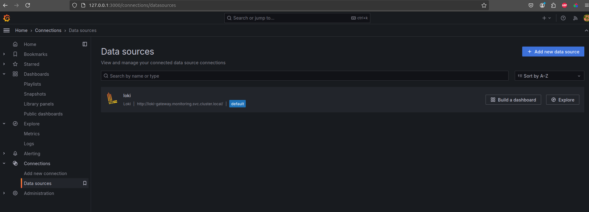
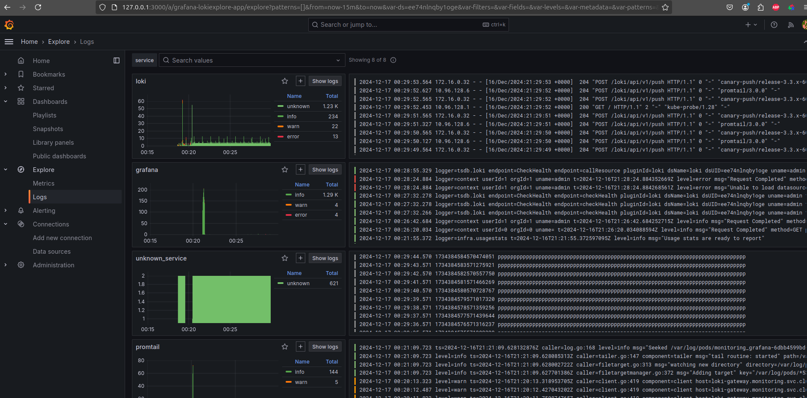
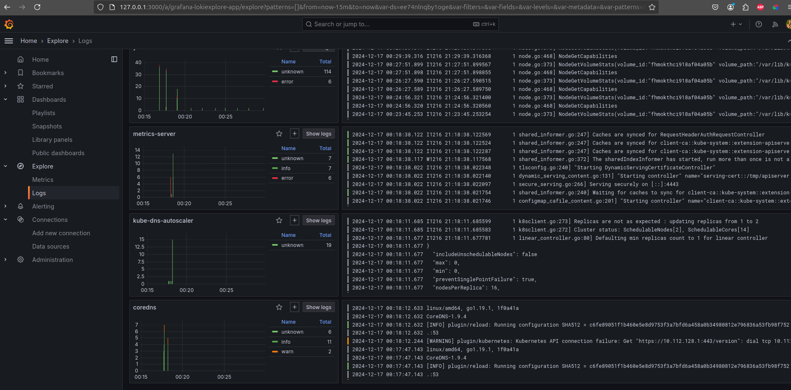
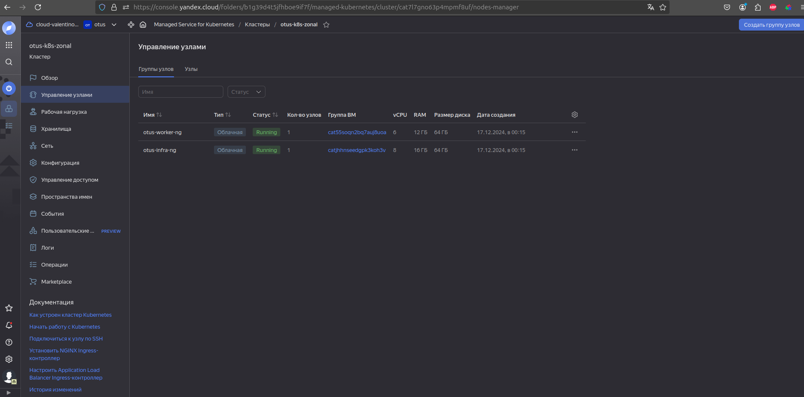
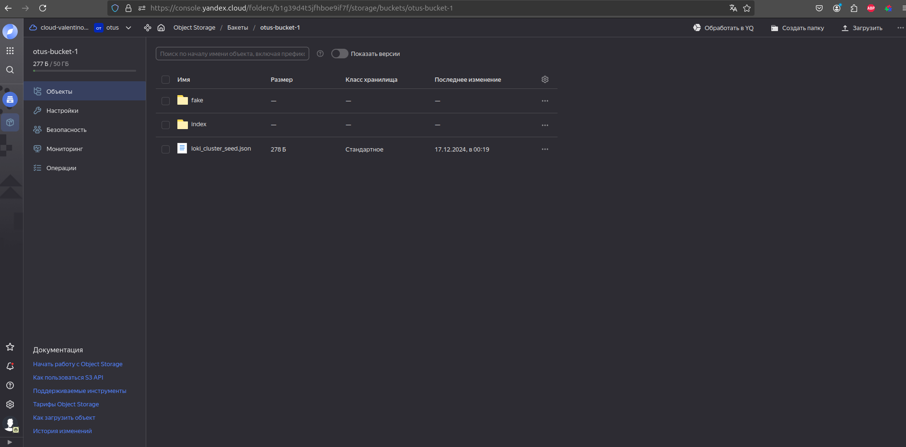

Для начала инициализируем облако и создаем минимально-необходимый набор ресурсов (сервисный аккаунт, статический ключ доступа, каталог, сеть), можно сделать при помощи yc утилиты, через веб-консоль или при помощи terraform:    
<details>

```bash

valyan@valyan-pc:~$ yc init
Welcome! This command will take you through the configuration process.
Please go to https://oauth.yandex.ru/authorize?response_type=token&client_id=****** in order to obtain OAuth token.
 Please enter OAuth token: *****************
You have one cloud available: '**********' (id = **********). It is going to be used by default.
Please choose folder to use:
 [1] otus (id = *****)
 [2] Create a new folder
Please enter your numeric choice: 1
Your current folder has been set to 'otus' (id = *****).
Do you want to configure a default Compute zone? [Y/n] y
Which zone do you want to use as a profile default?
 [1] ru-central1-a
 [2] ru-central1-b
 [3] ru-central1-d
 [4] Don't set default zone
Please enter your numeric choice: 1
Your profile default Compute zone has been set to 'ru-central1-a'.

valyan@valyan-pc:~$ yc config list
token: *****
cloud-id: *****
folder-id: *****
compute-default-zone: ru-central1-a
valyan@valyan-pc:~$ yc vpc network create \
  --name otus-network-1 \
  --description "Otus homeworks"
id: enpd43llv6d6ofu5eet4
folder_id: ********
created_at: "2024-12-14T07:54:49Z"
name: otus-network-1
description: Otus homeworks
default_security_group_id: ********


valyan@valyan-pc:~$ yc iam service-account create --name valyan-otus \
  --description "sa for otus homeworks"
done (1s)
id: ******
folder_id: *******
created_at: "2024-12-14T08:05:17.349521713Z"
name: valyan-otus
description: sa for otus homeworks

valyan@valyan-pc:~$ yc iam service-account list
+----------------------+-------------+--------+---------------------+-----------------------+
|          ID          |    NAME     | LABELS |     CREATED AT      | LAST AUTHENTICATED AT |
+----------------------+-------------+--------+---------------------+-----------------------+
| *****************    | valyan-otus |        | 2024-12-14 08:05:17 |                       |
| *****************    | valyan-sa   |        | 2022-09-01 10:20:06 |                       |
+----------------------+-------------+--------+---------------------+-----------------------+

valyan@valyan-pc:~$ yc resource-manager folder list
+----------------------+------+--------+--------+
|          ID          | NAME | LABELS | STATUS |
+----------------------+------+--------+--------+
| ******************** | otus |        | ACTIVE |
+----------------------+------+--------+--------+


valyan@valyan-pc:~/proj$ yc resource-manager folder list-access-bindings otus
+----------------------------------+----------------+----------------------+
|             ROLE ID              |  SUBJECT TYPE  |      SUBJECT ID      |
+----------------------------------+----------------+----------------------+
| k8s.clusters.agent               | serviceAccount | aje0ola33741hrsapv7v |
| vpc.publicAdmin                  | serviceAccount | aje0ola33741hrsapv7v |
| container-registry.images.puller | serviceAccount | aje0ola33741hrsapv7v |
| kms.keys.encrypterDecrypter      | serviceAccount | aje0ola33741hrsapv7v |
| storage.admin                    | serviceAccount | aje0ola33741hrsapv7v |
+----------------------------------+----------------+----------------------+

```
</details>


После чего либо из папки ./terraform запускаем создание кластера и групп нод при помощи terraform apply -auto-approve
Либо наклацываем себе кластер в веб-консоли (для первого раза лучше второй вариант, т.к по гайдам Яндекса и их манифестам работать не будет, нужно докручивать политики безопасности)  

После того, как кластер создан, проверяем, что ноды создались и на них назначены соответствующие лейблы и тейнты:  
<details>

```bash
valyan@valyan-pc:~$ kubectl get node -o wide --show-labels
NAME                        STATUS   ROLES    AGE     VERSION   INTERNAL-IP    EXTERNAL-IP      OS-IMAGE             KERNEL-VERSION      CONTAINER-RUNTIME     LABELS
cl1bpetnmjv76di1tubn-ijug   Ready    <none>   5m9s    v1.28.9   192.168.0.38   89.169.167.202   Ubuntu 20.04.6 LTS   5.4.0-196-generic   containerd://1.6.28   beta.kubernetes.io/arch=amd64,beta.kubernetes.io/instance-type=standard-v3,beta.kubernetes.io/os=linux,failure-domain.beta.kubernetes.io/zone=ru-central1-b,kubernetes.io/arch=amd64,kubernetes.io/hostname=cl1bpetnmjv76di1tubn-ijug,kubernetes.io/os=linux,node-role=worker,node.kubernetes.io/instance-type=standard-v3,node.kubernetes.io/kube-proxy-ds-ready=true,node.kubernetes.io/masq-agent-ds-ready=true,node.kubernetes.io/node-problem-detector-ds-ready=true,topology.kubernetes.io/zone=ru-central1-b,yandex.cloud/node-group-id=catd5ju7fq4rqas2ia2s,yandex.cloud/pci-topology=k8s,yandex.cloud/preemptible=false
cl1jdc9nsmd3g56odcnp-igyh   Ready    <none>   5m4s    v1.28.9   192.168.0.37   84.252.139.29    Ubuntu 20.04.6 LTS   5.4.0-196-generic   containerd://1.6.28   beta.kubernetes.io/arch=amd64,beta.kubernetes.io/instance-type=standard-v3,beta.kubernetes.io/os=linux,failure-domain.beta.kubernetes.io/zone=ru-central1-b,kubernetes.io/arch=amd64,kubernetes.io/hostname=cl1jdc9nsmd3g56odcnp-igyh,kubernetes.io/os=linux,node-role=infra,node.kubernetes.io/instance-type=standard-v3,node.kubernetes.io/kube-proxy-ds-ready=true,node.kubernetes.io/masq-agent-ds-ready=true,node.kubernetes.io/node-problem-detector-ds-ready=true,topology.kubernetes.io/zone=ru-central1-b,yandex.cloud/node-group-id=cat6ambll3thbij8cum1,yandex.cloud/pci-topology=k8s,yandex.cloud/preemptible=false
cl1jdc9nsmd3g56odcnp-ubyg   Ready    <none>   4m54s   v1.28.9   192.168.0.19   89.169.163.240   Ubuntu 20.04.6 LTS   5.4.0-196-generic   containerd://1.6.28   beta.kubernetes.io/arch=amd64,beta.kubernetes.io/instance-type=standard-v3,beta.kubernetes.io/os=linux,failure-domain.beta.kubernetes.io/zone=ru-central1-b,kubernetes.io/arch=amd64,kubernetes.io/hostname=cl1jdc9nsmd3g56odcnp-ubyg,kubernetes.io/os=linux,node-role=infra,node.kubernetes.io/instance-type=standard-v3,node.kubernetes.io/kube-proxy-ds-ready=true,node.kubernetes.io/masq-agent-ds-ready=true,node.kubernetes.io/node-problem-detector-ds-ready=true,topology.kubernetes.io/zone=ru-central1-b,yandex.cloud/node-group-id=cat6ambll3thbij8cum1,yandex.cloud/pci-topology=k8s,yandex.cloud/preemptible=false
valyan@valyan-pc:~$ kubectl get nodes -o custom-columns=NAME:.metadata.name,TAINTS:.spec.taints
NAME                        TAINTS
cl1bpetnmjv76di1tubn-ijug   <none>
cl1jdc9nsmd3g56odcnp-igyh   [map[effect:NoSchedule key:node-role value:infra]]
cl1jdc9nsmd3g56odcnp-ubyg   [map[effect:NoSchedule key:node-role value:infra]]
```
</details>

В данном случае создал 2 инфра-ноды, т.к при первоначальной настройке кластера указал слишком малую маску, из-за чего на одной ноде запускается ограниченное количество подов (в моем случае из-за 24 маски на cidr подов можно было запустить до 8 подов на ноде, пришлось полностью пересоздавать кластер и нод-группы)  

После того, как кластер и нод группы созданы, деплоим в namespace=monitoring по очереди loki, promtail и grafana:
<details>

```bash

valyan@valyan-pc:~/proj/Valyanchik_repo/kubernetes-logging$ helm upgrade --values loki-values.yaml --install -n monitoring  loki grafana/loki
Release "loki" does not exist. Installing it now.
NAME: loki
LAST DEPLOYED: Tue Dec 17 00:18:28 2024
NAMESPACE: monitoring
STATUS: deployed
REVISION: 1
NOTES:
***********************************************************************
 Welcome to Grafana Loki
 Chart version: 6.23.0
 Chart Name: loki
 Loki version: 3.3.1
***********************************************************************

** Please be patient while the chart is being deployed **

Tip:

  Watch the deployment status using the command: kubectl get pods -w --namespace monitoring

If pods are taking too long to schedule make sure pod affinity can be fulfilled in the current cluster.

***********************************************************************
Installed components:
***********************************************************************
* loki

Loki has been deployed as a single binary.
This means a single pod is handling reads and writes. You can scale that pod vertically by adding more CPU and memory resources.


***********************************************************************
Sending logs to Loki
***********************************************************************

Loki has been configured with a gateway (nginx) to support reads and writes from a single component.

You can send logs from inside the cluster using the cluster DNS:

http://loki-gateway.monitoring.svc.cluster.local/loki/api/v1/push

You can test to send data from outside the cluster by port-forwarding the gateway to your local machine:

  kubectl port-forward --namespace monitoring svc/loki-gateway 3100:80 &

And then using http://127.0.0.1:3100/loki/api/v1/push URL as shown below:


curl -H "Content-Type: application/json" -XPOST -s "http://127.0.0.1:3100/loki/api/v1/push"  \
--data-raw "{\"streams\": [{\"stream\": {\"job\": \"test\"}, \"values\": [[\"$(date +%s)000000000\", \"fizzbuzz\"]]}]}"


Then verify that Loki did received the data using the following command:


curl "http://127.0.0.1:3100/loki/api/v1/query_range" --data-urlencode 'query={job="test"}' | jq .data.result


***********************************************************************
Connecting Grafana to Loki
***********************************************************************

If Grafana operates within the cluster, you'll set up a new Loki datasource by utilizing the following URL:

http://loki-gateway.monitoring.svc.cluster.local/
valyan@valyan-pc:~/proj/Valyanchik_repo/kubernetes-logging$ helm upgrade --values promtail-values.yaml --install -n monitoring  promtail grafana/promtail
Release "promtail" does not exist. Installing it now.
NAME: promtail
LAST DEPLOYED: Tue Dec 17 00:19:56 2024
NAMESPACE: monitoring
STATUS: deployed
REVISION: 1
TEST SUITE: None
NOTES:
***********************************************************************
 Welcome to Grafana Promtail
 Chart version: 6.16.6
 Promtail version: 3.0.0
***********************************************************************

Verify the application is working by running these commands:
* kubectl --namespace monitoring port-forward daemonset/promtail 3101
* curl http://127.0.0.1:3101/metrics
valyan@valyan-pc:~/proj/Valyanchik_repo/kubernetes-logging$ helm upgrade --values grafana-values.yaml --install -n monitoring  grafana grafana/grafana
Release "grafana" does not exist. Installing it now.
NAME: grafana
LAST DEPLOYED: Tue Dec 17 00:20:52 2024
NAMESPACE: monitoring
STATUS: deployed
REVISION: 1
NOTES:
1. Get your 'admin' user password by running:

   kubectl get secret --namespace monitoring grafana -o jsonpath="{.data.admin-password}" | base64 --decode ; echo


2. The Grafana server can be accessed via port 80 on the following DNS name from within your cluster:

   grafana.monitoring.svc.cluster.local

   Get the Grafana URL to visit by running these commands in the same shell:
     export POD_NAME=$(kubectl get pods --namespace monitoring -l "app.kubernetes.io/name=grafana,app.kubernetes.io/instance=grafana" -o jsonpath="{.items[0].metadata.name}")
     kubectl --namespace monitoring port-forward $POD_NAME 3000

3. Login with the password from step 1 and the username: admin
#################################################################################
######   WARNING: Persistence is disabled!!! You will lose your data when   #####
######            the Grafana pod is terminated.                            #####
#################################################################################
helm install prometheus -n homework prometheus-community/kube-prometheus-stack
```
</details>

После чего форвардим порт до сервиса графаны и идем в веб-морду добавлять датасорс:
<details>

```bash
valyan@valyan-pc:~/proj/Valyanchik_repo/kubernetes-logging$ export POD_NAME=$(kubectl get pods --namespace monitoring -l "app.kubernetes.io/name=grafana,app.kubernetes.io/instance=grafana" -o jsonpath="{.items[0].metadata.name}")
     kubectl --namespace monitoring port-forward $POD_NAME 3000
Forwarding from 127.0.0.1:3000 -> 3000
Forwarding from [::1]:3000 -> 3000
Handling connection for 3000
```
</details>


datasource в grafana:  

Логи из добавленного источника:  


Группа нод в managed-kubernetes-cluster в веб-консоли:  

Бакет с данными из локи:  
