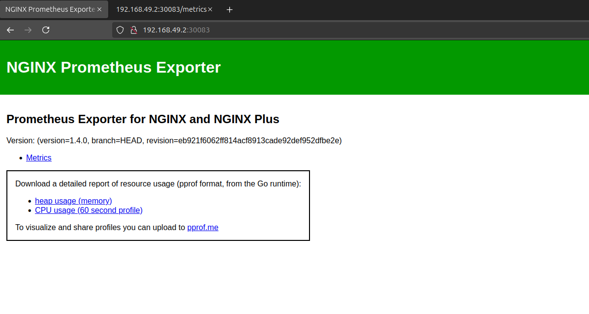
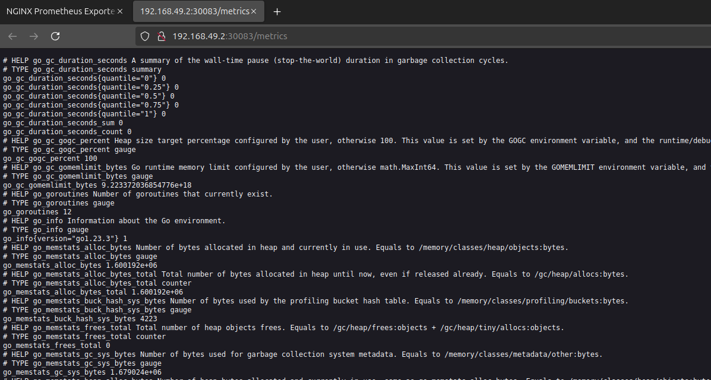
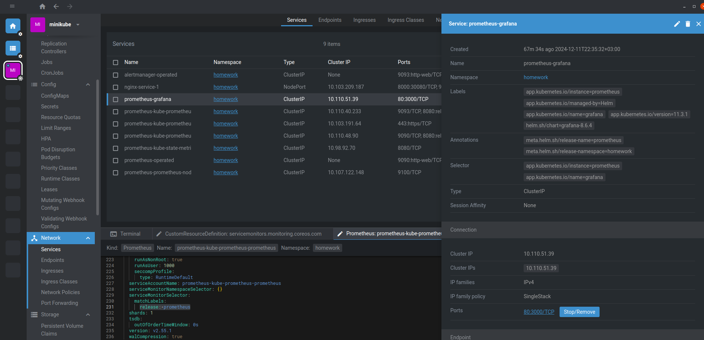
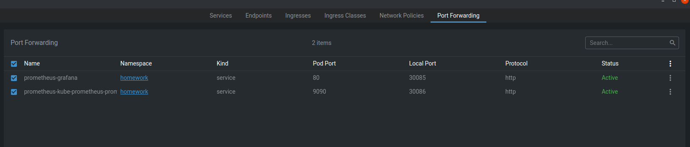
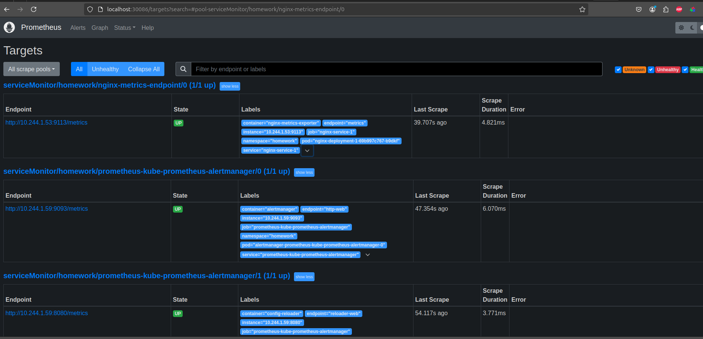
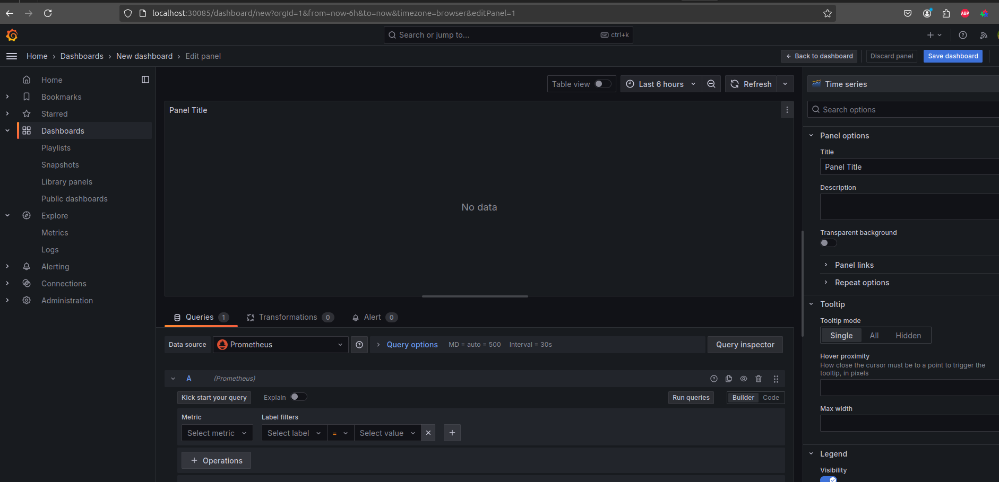

После запуска деплоймента с кастомным конфигом nginx, включающим модуль ngx_http_stub_status_module запускаем депоймент:
<details>

```bash
Name:                   nginx-deployment-1
Namespace:              homework
CreationTimestamp:      Wed, 11 Dec 2024 22:04:00 +0300
Labels:                 <none>
Annotations:            deployment.kubernetes.io/revision: 2
Selector:               homework=true
Replicas:               1 desired | 1 updated | 1 total | 1 available | 0 unavailable
StrategyType:           RollingUpdate
MinReadySeconds:        0
RollingUpdateStrategy:  1 max unavailable, 25% max surge
Pod Template:
  Labels:  homework=true
  Containers:
   nginx:
    Image:      nginx
    Port:       8000/TCP
    Host Port:  0/TCP
    Limits:
      cpu:     1
      memory:  512Mi
    Requests:
      cpu:        500m
      memory:     256Mi
    Environment:  <none>
    Mounts:
      /etc/nginx/conf.d from configfile (rw)
   nginx-metrics-exporter:
    Image:      nginx/nginx-prometheus-exporter:1.4.0
    Port:       9113/TCP
    Host Port:  0/TCP
    Args:
      --nginx.scrape-uri=http://localhost:8000/stub_status
    Limits:
      cpu:     250m
      memory:  256Mi
    Requests:
      cpu:        125m
      memory:     128Mi
    Environment:  <none>
    Mounts:       <none>
  Volumes:
   configfile:
    Type:          ConfigMap (a volume populated by a ConfigMap)
    Name:          nginx-config
    Optional:      false
  Node-Selectors:  <none>
  Tolerations:     <none>
Conditions:
  Type           Status  Reason
  ----           ------  ------
  Available      True    MinimumReplicasAvailable
  Progressing    True    NewReplicaSetAvailable
OldReplicaSets:  nginx-deployment-1-57c6d899b9 (0/0 replicas created)
NewReplicaSet:   nginx-deployment-1-69b997c767 (1/1 replicas created)
Events:          <none>
```
</details>

экзекаемся внутрь пода деплоймента и смотрим, что метрики после добавления модуля доступны:

<details>

```bash
root@nginx-deployment-1-69b997c767-b9dkf:/# curl localhost:8000/basic_status
Active connections: 1 
server accepts handled requests
 2 2 2 
Reading: 0 Writing: 1 Waiting: 0 
```
</details>

Создаем сервис для доступности ендпоинта метрик веб-сервера вне кластера: 

<details>

```bash
valyan@valyan-pc:~$ k describe svc -n homework nginx-service-1
Name:                     nginx-service-1
Namespace:                homework
Labels:                   app=nginx-service-1
Annotations:              <none>
Selector:                 homework=true
Type:                     NodePort
IP Family Policy:         SingleStack
IP Families:              IPv4
IP:                       10.103.209.187
IPs:                      10.103.209.187
Port:                     http  8000/TCP
TargetPort:               8000/TCP
NodePort:                 http  30080/TCP
Endpoints:                10.244.1.53:8000
Port:                     metrics  9113/TCP
TargetPort:               9113/TCP
NodePort:                 metrics  30083/TCP
Endpoints:                10.244.1.53:9113
Session Affinity:         None
External Traffic Policy:  Cluster
Internal Traffic Policy:  Cluster
Events:                   <none>
```
</details>

После чего запускаем тунель в миникубе (или порт-форвардим в ленсе или кубере) и переходим в веб-морду:  

Здесь доступен сам ендпоинт прометеус-экспортера для nginx:  

Сам список доступных метрик отображается при переходе по ссылке metrics:    


Полный список метрик:  
<details>

```bash
# HELP go_gc_duration_seconds A summary of the wall-time pause (stop-the-world) duration in garbage collection cycles.
# TYPE go_gc_duration_seconds summary
go_gc_duration_seconds{quantile="0"} 0
go_gc_duration_seconds{quantile="0.25"} 0
go_gc_duration_seconds{quantile="0.5"} 0
go_gc_duration_seconds{quantile="0.75"} 0
go_gc_duration_seconds{quantile="1"} 0
go_gc_duration_seconds_sum 0
go_gc_duration_seconds_count 0
# HELP go_gc_gogc_percent Heap size target percentage configured by the user, otherwise 100. This value is set by the GOGC environment variable, and the runtime/debug.SetGCPercent function. Sourced from /gc/gogc:percent
# TYPE go_gc_gogc_percent gauge
go_gc_gogc_percent 100
# HELP go_gc_gomemlimit_bytes Go runtime memory limit configured by the user, otherwise math.MaxInt64. This value is set by the GOMEMLIMIT environment variable, and the runtime/debug.SetMemoryLimit function. Sourced from /gc/gomemlimit:bytes
# TYPE go_gc_gomemlimit_bytes gauge
go_gc_gomemlimit_bytes 9.223372036854776e+18
# HELP go_goroutines Number of goroutines that currently exist.
# TYPE go_goroutines gauge
go_goroutines 12
# HELP go_info Information about the Go environment.
# TYPE go_info gauge
go_info{version="go1.23.3"} 1
# HELP go_memstats_alloc_bytes Number of bytes allocated in heap and currently in use. Equals to /memory/classes/heap/objects:bytes.
# TYPE go_memstats_alloc_bytes gauge
go_memstats_alloc_bytes 543680
# HELP go_memstats_alloc_bytes_total Total number of bytes allocated in heap until now, even if released already. Equals to /gc/heap/allocs:bytes.
# TYPE go_memstats_alloc_bytes_total counter
go_memstats_alloc_bytes_total 543680
# HELP go_memstats_buck_hash_sys_bytes Number of bytes used by the profiling bucket hash table. Equals to /memory/classes/profiling/buckets:bytes.
# TYPE go_memstats_buck_hash_sys_bytes gauge
go_memstats_buck_hash_sys_bytes 4223
# HELP go_memstats_frees_total Total number of heap objects frees. Equals to /gc/heap/frees:objects + /gc/heap/tiny/allocs:objects.
# TYPE go_memstats_frees_total counter
go_memstats_frees_total 0
# HELP go_memstats_gc_sys_bytes Number of bytes used for garbage collection system metadata. Equals to /memory/classes/metadata/other:bytes.
# TYPE go_memstats_gc_sys_bytes gauge
go_memstats_gc_sys_bytes 1.447528e+06
# HELP go_memstats_heap_alloc_bytes Number of heap bytes allocated and currently in use, same as go_memstats_alloc_bytes. Equals to /memory/classes/heap/objects:bytes.
# TYPE go_memstats_heap_alloc_bytes gauge
go_memstats_heap_alloc_bytes 543680
# HELP go_memstats_heap_idle_bytes Number of heap bytes waiting to be used. Equals to /memory/classes/heap/released:bytes + /memory/classes/heap/free:bytes.
# TYPE go_memstats_heap_idle_bytes gauge
go_memstats_heap_idle_bytes 1.089536e+06
# HELP go_memstats_heap_inuse_bytes Number of heap bytes that are in use. Equals to /memory/classes/heap/objects:bytes + /memory/classes/heap/unused:bytes
# TYPE go_memstats_heap_inuse_bytes gauge
go_memstats_heap_inuse_bytes 2.383872e+06
# HELP go_memstats_heap_objects Number of currently allocated objects. Equals to /gc/heap/objects:objects.
# TYPE go_memstats_heap_objects gauge
go_memstats_heap_objects 1110
# HELP go_memstats_heap_released_bytes Number of heap bytes released to OS. Equals to /memory/classes/heap/released:bytes.
# TYPE go_memstats_heap_released_bytes gauge
go_memstats_heap_released_bytes 1.089536e+06
# HELP go_memstats_heap_sys_bytes Number of heap bytes obtained from system. Equals to /memory/classes/heap/objects:bytes + /memory/classes/heap/unused:bytes + /memory/classes/heap/released:bytes + /memory/classes/heap/free:bytes.
# TYPE go_memstats_heap_sys_bytes gauge
go_memstats_heap_sys_bytes 3.473408e+06
# HELP go_memstats_last_gc_time_seconds Number of seconds since 1970 of last garbage collection.
# TYPE go_memstats_last_gc_time_seconds gauge
go_memstats_last_gc_time_seconds 0
# HELP go_memstats_mallocs_total Total number of heap objects allocated, both live and gc-ed. Semantically a counter version for go_memstats_heap_objects gauge. Equals to /gc/heap/allocs:objects + /gc/heap/tiny/allocs:objects.
# TYPE go_memstats_mallocs_total counter
go_memstats_mallocs_total 1110
# HELP go_memstats_mcache_inuse_bytes Number of bytes in use by mcache structures. Equals to /memory/classes/metadata/mcache/inuse:bytes.
# TYPE go_memstats_mcache_inuse_bytes gauge
go_memstats_mcache_inuse_bytes 33600
# HELP go_memstats_mcache_sys_bytes Number of bytes used for mcache structures obtained from system. Equals to /memory/classes/metadata/mcache/inuse:bytes + /memory/classes/metadata/mcache/free:bytes.
# TYPE go_memstats_mcache_sys_bytes gauge
go_memstats_mcache_sys_bytes 46800
# HELP go_memstats_mspan_inuse_bytes Number of bytes in use by mspan structures. Equals to /memory/classes/metadata/mspan/inuse:bytes.
# TYPE go_memstats_mspan_inuse_bytes gauge
go_memstats_mspan_inuse_bytes 54720
# HELP go_memstats_mspan_sys_bytes Number of bytes used for mspan structures obtained from system. Equals to /memory/classes/metadata/mspan/inuse:bytes + /memory/classes/metadata/mspan/free:bytes.
# TYPE go_memstats_mspan_sys_bytes gauge
go_memstats_mspan_sys_bytes 65280
# HELP go_memstats_next_gc_bytes Number of heap bytes when next garbage collection will take place. Equals to /gc/heap/goal:bytes.
# TYPE go_memstats_next_gc_bytes gauge
go_memstats_next_gc_bytes 4.194304e+06
# HELP go_memstats_other_sys_bytes Number of bytes used for other system allocations. Equals to /memory/classes/other:bytes.
# TYPE go_memstats_other_sys_bytes gauge
go_memstats_other_sys_bytes 1.146713e+06
# HELP go_memstats_stack_inuse_bytes Number of bytes obtained from system for stack allocator in non-CGO environments. Equals to /memory/classes/heap/stacks:bytes.
# TYPE go_memstats_stack_inuse_bytes gauge
go_memstats_stack_inuse_bytes 720896
# HELP go_memstats_stack_sys_bytes Number of bytes obtained from system for stack allocator. Equals to /memory/classes/heap/stacks:bytes + /memory/classes/os-stacks:bytes.
# TYPE go_memstats_stack_sys_bytes gauge
go_memstats_stack_sys_bytes 720896
# HELP go_memstats_sys_bytes Number of bytes obtained from system. Equals to /memory/classes/total:byte.
# TYPE go_memstats_sys_bytes gauge
go_memstats_sys_bytes 6.904848e+06
# HELP go_sched_gomaxprocs_threads The current runtime.GOMAXPROCS setting, or the number of operating system threads that can execute user-level Go code simultaneously. Sourced from /sched/gomaxprocs:threads
# TYPE go_sched_gomaxprocs_threads gauge
go_sched_gomaxprocs_threads 28
# HELP go_threads Number of OS threads created.
# TYPE go_threads gauge
go_threads 9
# HELP nginx_exporter_build_info A metric with a constant '1' value labeled by version, revision, branch, goversion from which nginx_exporter was built, and the goos and goarch for the build.
# TYPE nginx_exporter_build_info gauge
nginx_exporter_build_info{branch="HEAD",goarch="amd64",goos="linux",goversion="go1.23.3",revision="eb921f6062ff814acf8913cade92def952dfbe2e",tags="unknown",version="1.4.0"} 1
# HELP nginx_up Status of the last metric scrape
# TYPE nginx_up gauge
nginx_up 0
# HELP process_cpu_seconds_total Total user and system CPU time spent in seconds.
# TYPE process_cpu_seconds_total counter
process_cpu_seconds_total 0.01
# HELP process_max_fds Maximum number of open file descriptors.
# TYPE process_max_fds gauge
process_max_fds 1.048576e+06
# HELP process_network_receive_bytes_total Number of bytes received by the process over the network.
# TYPE process_network_receive_bytes_total counter
process_network_receive_bytes_total 7212
# HELP process_network_transmit_bytes_total Number of bytes sent by the process over the network.
# TYPE process_network_transmit_bytes_total counter
process_network_transmit_bytes_total 7982
# HELP process_open_fds Number of open file descriptors.
# TYPE process_open_fds gauge
process_open_fds 8
# HELP process_resident_memory_bytes Resident memory size in bytes.
# TYPE process_resident_memory_bytes gauge
process_resident_memory_bytes 1.1239424e+07
# HELP process_start_time_seconds Start time of the process since unix epoch in seconds.
# TYPE process_start_time_seconds gauge
process_start_time_seconds 1.73394397489e+09
# HELP process_virtual_memory_bytes Virtual memory size in bytes.
# TYPE process_virtual_memory_bytes gauge
process_virtual_memory_bytes 1.26746624e+09
# HELP process_virtual_memory_max_bytes Maximum amount of virtual memory available in bytes.
# TYPE process_virtual_memory_max_bytes gauge
process_virtual_memory_max_bytes 1.8446744073709552e+19
# HELP promhttp_metric_handler_requests_in_flight Current number of scrapes being served.
# TYPE promhttp_metric_handler_requests_in_flight gauge
promhttp_metric_handler_requests_in_flight 1
# HELP promhttp_metric_handler_requests_total Total number of scrapes by HTTP status code.
# TYPE promhttp_metric_handler_requests_total counter
promhttp_metric_handler_requests_total{code="200"} 0
promhttp_metric_handler_requests_total{code="500"} 0
promhttp_metric_handler_requests_total{code="503"} 0
```
</details>

После чего можно разворачивать prometheus-stack и настраивать интеграцию созданного ендпоинта метрик с системой мониторинга.  
Для этого устанавливаем чарт из официального источника:  


<details>

```bash
valyan@valyan-pc:~$ helm repo add prometheus-community https://prometheus-community.github.io/helm-charts
"prometheus-community" has been added to your repositories
valyan@valyan-pc:~$ helm repo update
Hang tight while we grab the latest from your chart repositories...
...Successfully got an update from the "pascaliske" chart repository
...Successfully got an update from the "prometheus-community" chart repository
Update Complete. ⎈Happy Helming!⎈
valyan@valyan-pc:~$ helm repo list
NAME                	URL                                               
pascaliske          	https://charts.pascaliske.dev                     
prometheus-community	https://prometheus-community.github.io/helm-charts
valyan@valyan-pc:~$ helm install prometheus -n homework prometheus-community/kube-prometheus-stack
NAME: prometheus
LAST DEPLOYED: Wed Dec 11 22:35:11 2024
NAMESPACE: homework
STATUS: deployed
REVISION: 1
NOTES:
kube-prometheus-stack has been installed. Check its status by running:
  kubectl --namespace homework get pods -l "release=prometheus"

Visit https://github.com/prometheus-operator/kube-prometheus for instructions on how to create & configure Alertmanager and Prometheus instances using the Operator.
```
</details>

После чего в целевом неймспейсе появляется целая куча обьектов:  

<details>

```bash
valyan@valyan-pc:~$ k get all -n homework
NAME                                                         READY   STATUS    RESTARTS   AGE
pod/alertmanager-prometheus-kube-prometheus-alertmanager-0   2/2     Running   0          63m
pod/nginx-deployment-1-69b997c767-b9dkf                      2/2     Running   0          92m
pod/prometheus-grafana-665f5c84b9-c6lb6                      3/3     Running   0          63m
pod/prometheus-kube-prometheus-operator-84df75b957-cvgvq     1/1     Running   0          63m
pod/prometheus-kube-state-metrics-6489887dc-wgwfr            1/1     Running   0          63m
pod/prometheus-prometheus-kube-prometheus-prometheus-0       2/2     Running   0          63m
pod/prometheus-prometheus-node-exporter-z42q8                1/1     Running   0          63m

NAME                                              TYPE        CLUSTER-IP       EXTERNAL-IP   PORT(S)                         AGE
service/alertmanager-operated                     ClusterIP   None             <none>        9093/TCP,9094/TCP,9094/UDP      63m
service/nginx-service-1                           NodePort    10.103.209.187   <none>        8000:30080/TCP,9113:30083/TCP   88m
service/prometheus-grafana                        ClusterIP   10.110.51.39     <none>        80/TCP                          63m
service/prometheus-kube-prometheus-alertmanager   ClusterIP   10.110.40.233    <none>        9093/TCP,8080/TCP               63m
service/prometheus-kube-prometheus-operator       ClusterIP   10.103.191.64    <none>        443/TCP                         63m
service/prometheus-kube-prometheus-prometheus     ClusterIP   10.110.48.90     <none>        9090/TCP,8080/TCP               63m
service/prometheus-kube-state-metrics             ClusterIP   10.98.92.70      <none>        8080/TCP                        63m
service/prometheus-operated                       ClusterIP   None             <none>        9090/TCP                        63m
service/prometheus-prometheus-node-exporter       ClusterIP   10.107.122.148   <none>        9100/TCP                        63m

NAME                                                 DESIRED   CURRENT   READY   UP-TO-DATE   AVAILABLE   NODE SELECTOR            AGE
daemonset.apps/prometheus-prometheus-node-exporter   1         1         1       1            1           kubernetes.io/os=linux   63m

NAME                                                  READY   UP-TO-DATE   AVAILABLE   AGE
deployment.apps/nginx-deployment-1                    1/1     1            1           95m
deployment.apps/prometheus-grafana                    1/1     1            1           63m
deployment.apps/prometheus-kube-prometheus-operator   1/1     1            1           63m
deployment.apps/prometheus-kube-state-metrics         1/1     1            1           63m

NAME                                                             DESIRED   CURRENT   READY   AGE
replicaset.apps/nginx-deployment-1-57c6d899b9                    0         0         0       95m
replicaset.apps/nginx-deployment-1-69b997c767                    1         1         1       92m
replicaset.apps/prometheus-grafana-665f5c84b9                    1         1         1       63m
replicaset.apps/prometheus-kube-prometheus-operator-84df75b957   1         1         1       63m
replicaset.apps/prometheus-kube-state-metrics-6489887dc          1         1         1       63m

NAME                                                                    READY   AGE
statefulset.apps/alertmanager-prometheus-kube-prometheus-alertmanager   1/1     63m
statefulset.apps/prometheus-prometheus-kube-prometheus-prometheus       1/1     63m

```
</details>

Так же добавляются CRD:  
<details>

```bash
valyan@valyan-pc:~$ k get crd
NAME                                        CREATED AT
alertmanagerconfigs.monitoring.coreos.com   2024-12-11T19:35:09Z
alertmanagers.monitoring.coreos.com         2024-12-11T19:35:09Z
mysqls.otus.homework                        2024-12-08T13:10:46Z
podmonitors.monitoring.coreos.com           2024-12-11T19:35:09Z
probes.monitoring.coreos.com                2024-12-11T19:35:09Z
prometheusagents.monitoring.coreos.com      2024-12-11T19:35:09Z
prometheuses.monitoring.coreos.com          2024-12-11T19:35:10Z
prometheusrules.monitoring.coreos.com       2024-12-11T19:35:10Z
scrapeconfigs.monitoring.coreos.com         2024-12-11T19:35:10Z
servicemonitors.monitoring.coreos.com       2024-12-11T19:35:10Z
thanosrulers.monitoring.coreos.com          2024-12-11T19:35:10Z
```
</details>

Нас интересует:  
servicemonitors.monitoring.coreos.com       2024-12-11T19:35:10Z

Именно для него мы и будем создавать CR serviceMonitor для интеграции нашего ендпоинта метрик веб-сервера с системой мониторинга:  

<details>

```bash
valyan@valyan-pc:~$ k describe servicemonitor -n homework nginx-metrics-endpoint 
Name:         nginx-metrics-endpoint
Namespace:    homework
Labels:       release=prometheus
Annotations:  <none>
API Version:  monitoring.coreos.com/v1
Kind:         ServiceMonitor
Metadata:
  Creation Timestamp:  2024-12-11T20:11:05Z
  Generation:          1
  Resource Version:    165760
  UID:                 79b3ceb0-e227-4152-8879-14b7e718af4f
Spec:
  Endpoints:
    Path:  /metrics
    Port:  metrics
  Selector:
    Match Labels:
      App:  nginx-service-1
Events:     <none>
```
</details>

Создав кастомный ресурс переходим в веб-морду прометея, чтобы убедиться, что новый таргет появился и метрики с него доступны в системе мониторинга. Для этого пробрасываем порт на целевых сервисах (prometheus и grafana):
  



И переходим в веб-интерфейс целевых сервисов:

Здесь видно, что наш добавленный посредством serviceMonitor ендпоинт метрик веб-сервера доступен


В веб-морде графаны можно визуализировать метрики со всей системы мониторинга и с добавленного в ДЗ ендпоинта в частности:  


  
