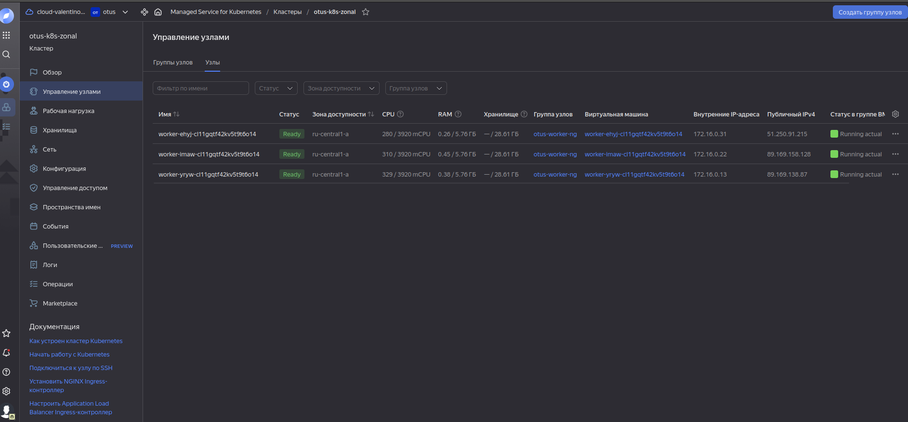
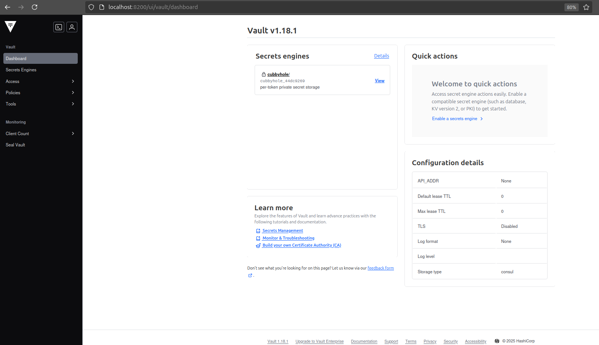
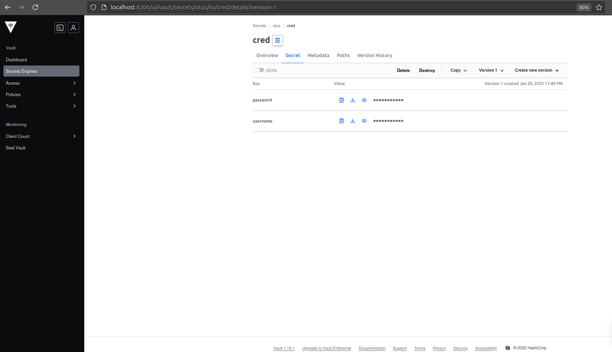
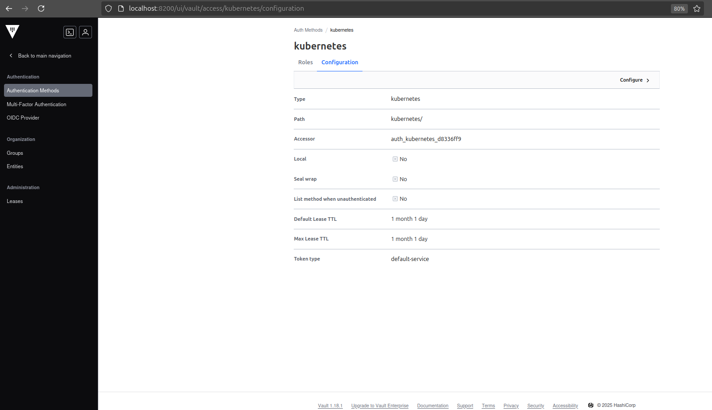
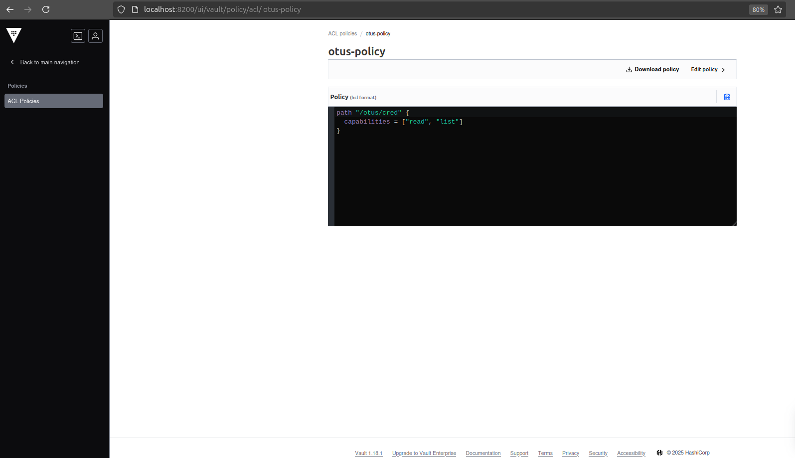
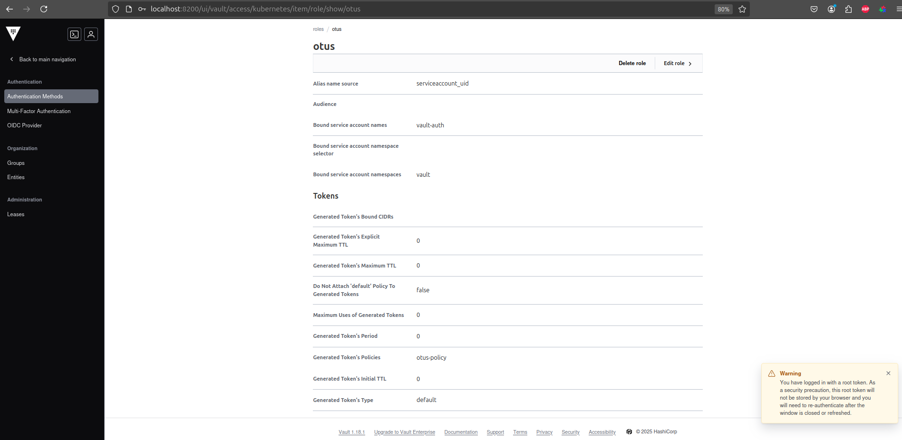

Создаем минимально-необходимый набор ресурсов (сервисный аккаунт, статический ключ доступа, каталог, сеть) и сам кластер с 3 нодами:  

Список развернутых нод:   

<details>

```bash
NAME                               STATUS   ROLES    AGE     VERSION
worker-ehyj-cl11gqtf42kv5t9t6o14   Ready    <none>   4m39s   v1.28.9
worker-imaw-cl11gqtf42kv5t9t6o14   Ready    <none>   4m26s   v1.28.9
worker-yryw-cl11gqtf42kv5t9t6o14   Ready    <none>   4m29s   v1.28.9


```
</details>
 
  


Устанавливаем consul:  

<details>

```bash

helm install consul -n consul -f 1-consul-values.yaml /home/valyan/proj/consul-k8s/charts/consul/
NAME: consul
LAST DEPLOYED: Mon Jan 20 23:25:36 2025
NAMESPACE: consul
STATUS: deployed
REVISION: 1
NOTES:
Thank you for installing HashiCorp Consul!

Your release is named consul.

To learn more about the release, run:

  $ helm status consul --namespace consul
  $ helm get all consul --namespace consul

Consul on Kubernetes Documentation:
https://www.consul.io/docs/platform/k8s

Consul on Kubernetes CLI Reference:
https://www.consul.io/docs/k8s/k8s-cli
valyan@valyan-pc:~/proj/Valyanchik_repo/kubernetes-vault$ k get all -n consul
NAME                                                      READY   STATUS    RESTARTS   AGE
pod/consul-consul-connect-injector-648d446497-5gg9b       1/1     Running   0          2m55s
pod/consul-consul-server-0                                1/1     Running   0          2m55s
pod/consul-consul-server-1                                1/1     Running   0          2m55s
pod/consul-consul-server-2                                1/1     Running   0          2m55s
pod/consul-consul-webhook-cert-manager-7bfb58bcf5-rkxvb   1/1     Running   0          2m55s

NAME                                     TYPE        CLUSTER-IP       EXTERNAL-IP   PORT(S)                                                                            AGE
service/consul-consul-connect-injector   ClusterIP   172.18.131.103   <none>        443/TCP                                                                            2m56s
service/consul-consul-dns                ClusterIP   172.18.178.250   <none>        53/TCP,53/UDP                                                                      2m56s
service/consul-consul-server             ClusterIP   None             <none>        8500/TCP,8502/TCP,8301/TCP,8301/UDP,8302/TCP,8302/UDP,8300/TCP,8600/TCP,8600/UDP   2m56s
service/consul-consul-ui                 ClusterIP   172.18.201.167   <none>        80/TCP                                                                             2m56s

NAME                                                 READY   UP-TO-DATE   AVAILABLE   AGE
deployment.apps/consul-consul-connect-injector       1/1     1            1           2m56s
deployment.apps/consul-consul-webhook-cert-manager   1/1     1            1           2m56s

NAME                                                            DESIRED   CURRENT   READY   AGE
replicaset.apps/consul-consul-connect-injector-648d446497       1         1         1       2m56s
replicaset.apps/consul-consul-webhook-cert-manager-7bfb58bcf5   1         1         1       2m56s

NAME                                    READY   AGE
statefulset.apps/consul-consul-server   3/3     2m56s

```
</details>

Устанавливаем vault предварительно выкачав чарт из гита:   

<details>

```bash
valyan@valyan-pc:~/proj/Valyanchik_repo/kubernetes-vault$ k get all -n vault
NAME                                        READY   STATUS    RESTARTS   AGE
pod/vault-0                                 0/1     Running   0          101s
pod/vault-1                                 0/1     Running   0          101s
pod/vault-2                                 0/1     Running   0          101s
pod/vault-agent-injector-67745cc7bd-ztd5q   1/1     Running   0          101s

NAME                               TYPE        CLUSTER-IP       EXTERNAL-IP   PORT(S)             AGE
service/vault                      ClusterIP   172.18.252.71    <none>        8200/TCP,8201/TCP   101s
service/vault-active               ClusterIP   172.18.168.4     <none>        8200/TCP,8201/TCP   101s
service/vault-agent-injector-svc   ClusterIP   172.18.131.220   <none>        443/TCP             101s
service/vault-internal             ClusterIP   None             <none>        8200/TCP,8201/TCP   101s
service/vault-standby              ClusterIP   172.18.151.27    <none>        8200/TCP,8201/TCP   101s

NAME                                   READY   UP-TO-DATE   AVAILABLE   AGE
deployment.apps/vault-agent-injector   1/1     1            1           102s

NAME                                              DESIRED   CURRENT   READY   AGE
replicaset.apps/vault-agent-injector-67745cc7bd   1         1         1       102s

NAME                     READY   AGE
statefulset.apps/vault   0/3     102s

 ```
</details>

После установки инициализируем инстанс vault:   

<details>

```bash
valyan@valyan-pc:~/proj/Valyanchik_repo/kubernetes-vault$ k exec -it -n vault vault-0 -- sh
/ $ vault operator init -key-shares=2 -key-threshold=2
Unseal Key 1: ****************
Unseal Key 2: ************************************

Initial Root Token: ************************

Vault initialized with 2 key shares and a key threshold of 2. Please securely
distribute the key shares printed above. When the Vault is re-sealed,
restarted, or stopped, you must supply at least 2 of these keys to unseal it
before it can start servicing requests.

Vault does not store the generated root key. Without at least 2 keys to
reconstruct the root key, Vault will remain permanently sealed!

It is possible to generate new unseal keys, provided you have a quorum of
existing unseal keys shares. See "vault operator rekey" for more information.

/ $ vault operator unseal
Unseal Key (will be hidden): 
Key                Value
---                -----
Seal Type          shamir
Initialized        true
Sealed             true
Total Shares       2
Threshold          2
Unseal Progress    1/2
Unseal Nonce       941aae0f-ece5-2d8e-2a12-e9e27e42527e
Version            1.18.1
Build Date         2024-10-29T14:21:31Z
Storage Type       consul
HA Enabled         true
/ $ vault operator unseal
Unseal Key (will be hidden): 
Key             Value
---             -----
Seal Type       shamir
Initialized     true
Sealed          false
Total Shares    2
Threshold       2
Version         1.18.1
Build Date      2024-10-29T14:21:31Z
Storage Type    consul
Cluster Name    vault-cluster-45c2ccab
Cluster ID      916c786f-7cc1-a692-9cdc-6a5db5327bfd
HA Enabled      true
HA Cluster      https://vault-0.vault-internal:8201
HA Mode         active
Active Since    2025-01-20T20:34:07.858259881Z

 ```
</details>

После инициализации нас интересуют поля:     

<details>

```bash
Initialized     true
Sealed          false
HA Enabled      true
 ```
</details>

Форвардим основной сервис vault и переходим в веб-морду для дальнейшей настройки:   

  

Создаем Secrets Engines и secret внутри него:  

  

Создаем сервисный аккаунт и роль с роль-биндингом для vault:  

<details>

```bash
k apply -f 3-sa.yaml 
serviceaccount/vault-auth created
clusterrolebinding.rbac.authorization.k8s.io/vault-auth created
secret/vault-auth-token created
 ```
</details>


создаем auth-method k8s и мапим на него наш созданный sa забрав из него ca для k8s-кластера, jwt-токен и сам адрес кластера:  

 

Создаем ACL-policy и назначаем в ее рамках права на созданный ранее секрет:  

<details>

```bash
path "otus/cred" {
  capabilities = ["read", "list"]
}
 ```
</details>

 

Создаем auth-role:    

 

<details>

```bash
valyan@valyan-pc:~/proj/vault-helm$ helm install external-secrets    external-secrets/external-secrets     -n vault
NAME: external-secrets
LAST DEPLOYED: Mon Jan 20 23:57:31 2025
NAMESPACE: vault
STATUS: deployed
REVISION: 1
TEST SUITE: None
NOTES:
external-secrets has been deployed successfully in namespace vault!

In order to begin using ExternalSecrets, you will need to set up a SecretStore
or ClusterSecretStore resource (for example, by creating a 'vault' SecretStore).

More information on the different types of SecretStores and how to configure them
can be found in our Github: https://github.com/external-secrets/external-secrets
 ```
</details>

По итогам получаетс 3 установленных чарта:  

<details>

```bash
alyan@valyan-pc:~/proj/vault-helm$ helm list -A
NAME            	NAMESPACE	REVISION	UPDATED                                	STATUS  	CHART                  	APP VERSION
consul          	consul   	1       	2025-01-20 23:25:36.251645828 +0300 MSK	deployed	consul-1.7.0-dev       	1.21-dev   
external-secrets	vault    	1       	2025-01-20 23:57:31.29516669 +0300 MSK 	deployed	external-secrets-0.12.1	v0.12.1    
vault           	vault    	1       	2025-01-20 23:30:47.676821147 +0300 MSK	deployed	vault-0.29.1           	1.18.1   
 ```
</details>

ExternalSecretsOperator добавил ччасть ресурсов в namespace=vault и создал новые CRD:  

<details>

```bash
valyan@valyan-pc:~/proj/vault-helm$ k get all -n vault
NAME                                                    READY   STATUS    RESTARTS   AGE
pod/external-secrets-7967bbc954-vw8jn                   1/1     Running   0          2m54s
pod/external-secrets-cert-controller-5d9454c4b7-jbtqx   1/1     Running   0          2m54s
pod/external-secrets-webhook-5b4869d4d4-2fspl           1/1     Running   0          2m54s
pod/vault-0                                             1/1     Running   0          29m
pod/vault-1                                             0/1     Running   0          29m
pod/vault-2                                             0/1     Running   0          29m
pod/vault-agent-injector-67745cc7bd-ztd5q               1/1     Running   0          29m

NAME                               TYPE        CLUSTER-IP       EXTERNAL-IP   PORT(S)             AGE
service/external-secrets-webhook   ClusterIP   172.18.217.185   <none>        443/TCP             2m54s
service/vault                      ClusterIP   172.18.252.71    <none>        8200/TCP,8201/TCP   29m
service/vault-active               ClusterIP   172.18.168.4     <none>        8200/TCP,8201/TCP   29m
service/vault-agent-injector-svc   ClusterIP   172.18.131.220   <none>        443/TCP             29m
service/vault-internal             ClusterIP   None             <none>        8200/TCP,8201/TCP   29m
service/vault-standby              ClusterIP   172.18.151.27    <none>        8200/TCP,8201/TCP   29m

NAME                                               READY   UP-TO-DATE   AVAILABLE   AGE
deployment.apps/external-secrets                   1/1     1            1           2m54s
deployment.apps/external-secrets-cert-controller   1/1     1            1           2m54s
deployment.apps/external-secrets-webhook           1/1     1            1           2m54s
deployment.apps/vault-agent-injector               1/1     1            1           29m

NAME                                                          DESIRED   CURRENT   READY   AGE
replicaset.apps/external-secrets-7967bbc954                   1         1         1       2m54s
replicaset.apps/external-secrets-cert-controller-5d9454c4b7   1         1         1       2m54s
replicaset.apps/external-secrets-webhook-5b4869d4d4           1         1         1       2m54s
replicaset.apps/vault-agent-injector-67745cc7bd               1         1         1       29m

NAME                     READY   AGE
statefulset.apps/vault   1/3     29m

 ```
</details>

Создаем secretstore:  

<details>

```bash
k apply -f 4-secretstore.yaml 
secretstore.external-secrets.io/otus-secretstore created
describe secretstores.external-secrets.io -n vault otus-secretstore 
Name:         otus-secretstore
Namespace:    vault
Labels:       <none>
Annotations:  <none>
API Version:  external-secrets.io/v1beta1
Kind:         SecretStore
Metadata:
  Creation Timestamp:  2025-01-20T21:15:38Z
  Generation:          1
  Resource Version:    18418
  UID:                 643d2e4d-8d0f-4548-80ec-902cc4cd1b93
Spec:
  Provider:
    Vault:
      Auth:
        Kubernetes:
          Mount Path:  kubernetes
          Role:        otus
          Service Account Ref:
            Name:  vault-auth
      Namespace:   vault
      Path:        otus
      Server:      http://172.18.252.71:8200
      Version:     v2
  Retry Settings:
    Max Retries:     5
    Retry Interval:  10s
Status:
  Capabilities:  ReadWrite
  Conditions:
    Last Transition Time:  2025-01-20T21:19:12Z
    Message:               unable to create client
    Reason:                InvalidProviderConfig
    Status:                False
    Type:                  Ready
Events:
  Type     Reason                 Age                  From          Message
  ----     ------                 ----                 ----          -------
  Normal   Valid                  75s                  secret-store  store validated
  Warning  InvalidProviderConfig  15s (x3 over 2m15s)  secret-store  unable to log in to auth method: unable to log in with Kubernetes auth: context deadline exceeded


 ```
</details>

После того, как хранилка подключается к провайдеру - создаем externalsecret:  

<details>

```bash
k apply -f 5-externalsecret.yaml 
externalsecret.external-secrets.io/otus-extsecret created
k describe -n vault externalsecrets.external-secrets.io otus-extsecret 
Name:         otus-extsecret
Namespace:    vault
Labels:       <none>
Annotations:  <none>
API Version:  external-secrets.io/v1beta1
Kind:         ExternalSecret
Metadata:
  Creation Timestamp:  2025-01-20T21:04:09Z
  Generation:          1
  Resource Version:    13999
  UID:                 d9248a57-0f40-4955-a84a-124c1b634442
Spec:
  Data From:
    Extract:
      Conversion Strategy:  Default
      Decoding Strategy:    None
      Key:                  cred
      Metadata Policy:      None
  Refresh Interval:         1h
  Secret Store Ref:
    Kind:  SecretStore
    Name:  otus-secretstore
  Target:
    Creation Policy:  Owner
    Deletion Policy:  Retain
    Name:             otus-cred
Status:
  Binding:
    Name:  
  Conditions:
    Last Transition Time:  2025-01-20T21:04:09Z
    Message:               could not get secret data from provider
    Reason:                SecretSyncedError
    Status:                False
    Type:                  Ready
  Refresh Time:            <nil>
Events:
  Type     Reason        Age                 From              Message
  ----     ------        ----                ----              -------
  Warning  UpdateFailed  10s (x15 over 92s)  external-secrets  error processing spec.dataFrom[0].extract, err: SecretStore "otus-secretstore" is not ready

k logs -n vault external-secrets-7967bbc954-vw8jn external-secrets 

{"level":"error","ts":1737408072.7858293,"msg":"Reconciler error","controller":"secretstore","controllerGroup":"external-secrets.io","controllerKind":"SecretStore","SecretStore":{"name":"otus-secretstore","namespace":"vault"},"namespace":"vault","name":"otus-secretstore","reconcileID":"c883b4db-bf39-447c-92b2-9b9c20576391","error":"could not get provider client: unable to log in to auth method: unable to log in with Kubernetes auth: context deadline exceeded","stacktrace":"sigs.k8s.io/controller-runtime/pkg/internal/controller.(*Controller[...]).reconcileHandler\n\t/home/runner/go/pkg/mod/sigs.k8s.io/controller-runtime@v0.19.3/pkg/internal/controller/controller.go:316\nsigs.k8s.io/controller-runtime/pkg/internal/controller.(*Controller[...]).processNextWorkItem\n\t/home/runner/go/pkg/mod/sigs.k8s.io/controller-runtime@v0.19.3/pkg/internal/controller/controller.go:263\nsigs.k8s.io/controller-runtime/pkg/internal/controller.(*Controller[...]).Start.func2.2\n\t/home/runner/go/pkg/mod/sigs.k8s.io/controller-runtime@v0.19.3/pkg/internal/controller/controller.go:224"}

 ```
</details>
здесь в виду того, что хранилка время от времени отваливается от vault - externalsecret не создает секрет в целевом namespace  